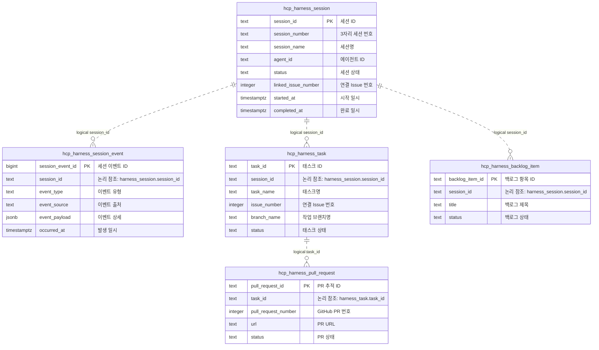
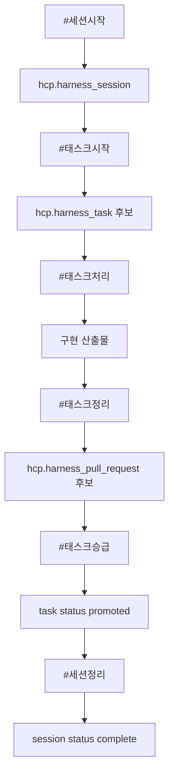
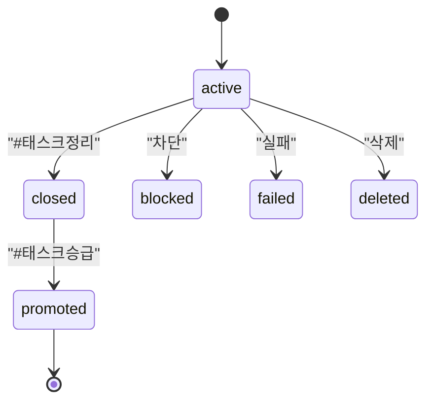

# DSN-008 DB 테이블 설계서

| 항목 | 값 |
|---|---|
| 문서 ID | DSN-008 |
| 문서 유형 | 설계 |
| 상태 | Draft |
| 성숙도 | Candidate |
| 버전 | v0.1 |
| 소유자 | jk |
| 작성 에이전트 | Codex |
| 기준 브랜치 | main |
| 작업 브랜치 | task_codex/084-db-table-design-doc-draft |
| 최종 수정일 | 2026-07-14 |

## 목차

- [1. 목적](#1-목적)
- [2. 적용 범위](#2-적용-범위)
- [3. 설계 원칙](#3-설계-원칙)
- [4. 이력 관리](#4-이력-관리)
- [5. 스키마 구성](#5-스키마-구성)
- [6. 현재 테이블 카탈로그](#6-현재-테이블-카탈로그)
- [7. 후보 테이블 카탈로그](#7-후보-테이블-카탈로그)
- [8. 논리 참조 기준](#8-논리-참조-기준)
- [9. 상태값 기준](#9-상태값-기준)
- [10. 시각화 샘플](#10-시각화-샘플)
- [11. 테이블 상세 샘플](#11-테이블-상세-샘플)
- [12. 검증 기준](#12-검증-기준)
- [13. 관련 문서](#13-관련-문서)
- [작업 이력](#작업-이력)

## 1. 목적

본 문서는 JKADH 서비스와 Harness 운영 데이터를 PostgreSQL에 저장하기 위한 테이블 설계 기준과 검토용 초안을 정의한다.

서비스 테이블을 바로 구현하기 전에 스키마 경계, 테이블 명명, 논리 참조, 상태값, 한글 COMMENT, 초기화 기준을 먼저 합의하는 것을 목표로 한다.

## 2. 적용 범위

본 문서는 다음 영역에 적용한다.

- `meta` 스키마의 DB migration 메타 관리
- `dict` 스키마의 단어, 용어, 도메인 정책 관리
- `hcp` 스키마의 Harness 세션, 태스크, PR, 백로그 상태 관리
- 이후 추가될 서비스 업무 스키마와 테이블 설계 검토

다음 항목은 본 문서에서 구현하지 않는다.

- 실제 서비스 테이블 migration 작성
- HCP DB write-store 전환
- dev/stg/prd DB reset 실행
- 모든 최종 DDL 확정
- 초안 검토 전 이력 snapshot 파일 생성

## 3. 설계 원칙

DB 설계는 다음 기준을 따른다.

| 기준 | 설명 |
|---|---|
| 스키마 분리 | 스키마는 업무 그룹 또는 책임 경계 단위로 분리한다. |
| 테이블명 | 테이블명은 가능한 풀네임을 사용한다. 단, 스키마명은 `meta`, `dict`, `hcp`처럼 짧고 안정적인 이름을 허용한다. |
| 컬럼명 | 컬럼명은 `snake_case`를 사용하고, 의미가 흐려지는 과도한 축약은 피한다. |
| FK 정책 | 물리 FK는 기본적으로 지양한다. 연결은 논리 참조 컬럼과 검증 쿼리로 관리한다. |
| COMMENT | 모든 스키마, 테이블, 컬럼에는 한글 COMMENT를 작성한다. |
| 상태값 | 상태값은 CHECK 제약 또는 사전 테이블로 허용 범위를 명시한다. |
| 초기화 | baseline/reset은 현재 합의된 최종 구조를 재현할 수 있어야 한다. |
| migration | migration 파일은 3자리 순번 파일명으로 관리한다. |

## 4. 이력 관리

설계 문서는 최신 초안을 본문 파일에서 관리한다. 모든 커밋마다 별도 이력 파일을 만들지 않는다.

변곡점이 생기고 사용자가 명시적으로 요청한 경우에만 하위 이력 폴더에 snapshot 파일을 남긴다. 이력 snapshot은 당시 설계 판단, 주요 변경점, 보류된 쟁점, 다음 검토 지점을 남기는 용도로 사용한다.

초기 기준은 다음과 같다.

| 항목 | 기준 |
|---|---|
| 최신본 | `docs/05.설계/DSN-008_DB_테이블_설계서.md` |
| 이력 폴더 | `docs/05.설계/history/` |
| 이력 등록 시점 | 사용자 요청 시 |
| 첫 이력 파일 | 초안 검토 완료 후 사용자 요청이 있을 때 생성 |
| 파일명 예시 | `DSN-008_2026-07-14_DB_테이블_설계서_초안검토.md` |

이번 초안에서는 첫 이력 snapshot 파일을 만들지 않는다.

## 5. 스키마 구성

현재 기준 스키마는 다음과 같다.

| 스키마 | 용도 | 명명 판단 |
|---|---|---|
| `meta` | DB migration과 초기화 메타 정보 관리 | 짧고 반복 사용되는 고정 스키마명이므로 축약 허용 |
| `dict` | 단어, 용어, 도메인, alias, 권장어, 금지어 정책 관리 | dictionary보다 짧고 의미가 명확하므로 축약 허용 |
| `hcp` | Harness Control Plane 세션, 태스크, PR, 백로그 상태 관리 | Harness 내부 약어로 반복 사용되므로 축약 허용 |

후보 서비스 스키마는 별도 검토 후 추가한다. 서비스 스키마는 업무 도메인이 드러나는 이름을 우선하며, 축약은 팀 내 반복 사용과 의미 안정성이 확인된 경우에만 허용한다.

## 6. 현재 테이블 카탈로그

현재 migration/baseline에 반영된 테이블은 다음과 같다.

| 스키마 | 테이블 | 책임 | 주요 논리 키 |
|---|---|---|---|
| `meta` | `schema_migration` | migration 적용 이력 관리 | `version`, `name` |
| `dict` | `domain` | 업무/기술 도메인 관리 | `domain_id`, `domain_key` |
| `dict` | `term` | 도메인별 표준 용어 관리 | `term_id`, `domain_id`, `term_key` |
| `dict` | `term_label` | 용어의 한국어/영어 표시명 관리 | `term_label_id`, `term_id` |
| `dict` | `term_alias` | alias, tag, slug, legacy, abbreviation 관리 | `term_alias_id`, `term_id` |
| `dict` | `term_policy` | 권장어, 금지어, deprecated 표현 관리 | `term_policy_id`, `term_id` |
| `dict` | `term_relation` | 용어 간 참조, 포함, 대체, 관련 관계 관리 | `term_relation_id`, `source_term_id`, `target_term_id` |
| `hcp` | `harness_session` | Harness 세션 식별자와 상태 관리 | `session_id` |
| `hcp` | `harness_session_event` | 세션 상태 변경과 후처리 이벤트 기록 | `session_event_id`, `session_id` |

## 7. 후보 테이블 카탈로그

다음 테이블은 후속 설계 검토 후보이다. 본 문서는 구현 확정이 아니라 검토용 구조를 제시한다.

| 스키마 | 후보 테이블 | 책임 | 우선순위 |
|---|---|---|---|
| `hcp` | `harness_task` | HCP 태스크 식별자, 상태, Issue, branch 연결 관리 | High |
| `hcp` | `harness_task_event` | 태스크 상태 전이와 실행 이벤트 기록 | High |
| `hcp` | `harness_pull_request` | 태스크와 연결된 GitHub PR 추적 | Medium |
| `hcp` | `harness_backlog_item` | 세션 중 등록된 HCP runtime backlog 추적 | Medium |
| `hcp` | `harness_issue` | 세션/태스크와 연결된 GitHub Issue snapshot 관리 | Medium |
| `hcp` | `harness_branch` | 작업 브랜치, 기준 브랜치, 승급 대상 브랜치 추적 | Low |

서비스 업무 테이블은 HCP 운영 테이블과 분리한다. HCP는 작업 제어와 운영 상태를 관리하고, 서비스 테이블은 실제 사용자 기능과 도메인 데이터를 관리한다.

## 8. 논리 참조 기준

물리 FK를 지양하되 연결 기준은 명시적으로 관리한다.

| 출발 테이블 | 컬럼 | 대상 | 검증 방식 |
|---|---|---|---|
| `hcp.harness_session_event` | `session_id` | `hcp.harness_session.session_id` | orphan 검증 쿼리 |
| `hcp.harness_task` | `session_id` | `hcp.harness_session.session_id` | orphan 검증 쿼리 |
| `hcp.harness_task_event` | `task_id` | `hcp.harness_task.task_id` | orphan 검증 쿼리 |
| `hcp.harness_pull_request` | `task_id` | `hcp.harness_task.task_id` | orphan 검증 쿼리 |
| `hcp.harness_backlog_item` | `session_id` | `hcp.harness_session.session_id` | orphan 검증 쿼리 |
| `dict.term` | `domain_id` | `dict.domain.domain_id` | orphan 검증 쿼리 |
| `dict.term_label` | `term_id` | `dict.term.term_id` | orphan 검증 쿼리 |

검증 쿼리는 `db validate` 확장 대상으로 둔다. FK가 없더라도 연결 컬럼의 의미는 COMMENT와 설계서에 반드시 남긴다.

## 9. 상태값 기준

초기 상태값은 CHECK 제약으로 관리한다. 상태값이 많아지거나 UI/API에서 동적 관리가 필요해지면 `dict` 사전 또는 별도 code 테이블로 승격한다.

| 영역 | 컬럼 | 후보 값 |
|---|---|---|
| 세션 | `status` | `active`, `complete`, `blocked`, `failed`, `archived` |
| 태스크 | `status` | `active`, `closed`, `promoted`, `blocked`, `failed`, `deleted` |
| PR | `status` | `draft`, `open`, `merged`, `closed` |
| 백로그 | `status` | `open`, `closed`, `deferred` |
| 용어 | `lifecycle_status` | `active`, `deprecated`, `reserved` |

상태 컬럼명은 현재 구현과의 호환성을 우선해 `status`를 유지한다. 서비스 업무 테이블에서 상태 의미가 충돌할 경우 `task_status`, `issue_status`처럼 도메인 접두어를 붙인다.

## 10. 시각화 샘플

### 10.1 HCP 논리 ERD



### 10.2 HCP 작업 흐름



### 10.3 태스크 상태 전이



## 11. 테이블 상세 샘플

### 11.1 hcp.harness_task

| 컬럼 | 타입 | 필수 | 기본값 | 설명 |
|---|---|---|---|---|
| `task_id` | text | Y | - | Harness 태스크 ID |
| `session_id` | text | Y | - | 세션 ID. FK 없이 `hcp.harness_session.session_id`와 논리 연결 |
| `task_name` | text | Y | - | 태스크명 |
| `status` | text | Y | `active` | 태스크 상태 |
| `issue_number` | integer | N | - | 연결 GitHub Issue 번호 |
| `branch_name` | text | N | - | 작업 브랜치명 |
| `pull_request_number` | integer | N | - | 대표 GitHub PR 번호 |
| `created_at` | timestamptz | Y | `now()` | 생성 일시 |
| `updated_at` | timestamptz | Y | `now()` | 최종 수정 일시 |

필수 COMMENT 예시는 다음과 같다.

```sql
comment on table hcp.harness_task is 'Harness 태스크 식별자, 상태, Issue, branch 연결 정보를 관리하는 테이블';
comment on column hcp.harness_task.session_id is '태스크가 속한 Harness 세션 ID. 물리 제약 없이 논리 연결로 관리한다';
```

### 11.2 hcp.harness_pull_request

| 컬럼 | 타입 | 필수 | 기본값 | 설명 |
|---|---|---|---|---|
| `pull_request_id` | text | Y | - | HCP PR 추적 ID |
| `task_id` | text | Y | - | 태스크 ID. FK 없이 `hcp.harness_task.task_id`와 논리 연결 |
| `provider` | text | Y | `github` | PR 제공자 |
| `pull_request_number` | integer | Y | - | GitHub PR 번호 |
| `url` | text | N | - | PR URL |
| `status` | text | Y | `open` | PR 상태 |
| `created_at` | timestamptz | Y | `now()` | 생성 일시 |
| `updated_at` | timestamptz | Y | `now()` | 최종 수정 일시 |

## 12. 검증 기준

설계서 기반 구현은 다음 검증을 통과해야 한다.

| 검증 | 기준 |
|---|---|
| `git diff --check` | Markdown 공백과 패치 기본 오류가 없어야 한다. |
| `npm test` | Harness CLI 단위 테스트가 통과해야 한다. |
| `npm run check` | CLI 문법 검사가 통과해야 한다. |
| `db reset --dry-run` | baseline 파일과 migration 기록 수가 기대값으로 표시되어야 한다. |
| `db migrate --dry-run` | checksum 불일치 없이 pending migration을 식별해야 한다. |
| `db validate` | legacy schema가 없고 FK count가 0이어야 한다. |

현재 dev DB는 기존 `001~006` migration checksum 기록 불일치가 있어 `db migrate --dry-run`이 차단될 수 있다. 이는 별도 정리 태스크에서 해소한다.

## 13. 관련 문서

- [DSN-004 Harness DB 운영데이터 설계](./DSN-004_Harness_DB_운영데이터_설계.md)
- [POL-001 문서관리방안](../03.정책/POL-001_문서관리방안.md)
- [Backlog 미해결 인덱스](../15.로그/backlog/README.md)

[목차로 이동](#목차)

---

## 작업 이력

| 작업일시 | 관련 Issue | 작업 도구 | AI 모델 | 에이전트 역할 | 작성자 | 변경 유형 | 내용 |
|---|---|---|---|---|---|---|---|
| 2026-07-14 | [#84](https://github.com/jkoogit/jkadh/issues/84) | Codex | GPT-5 | CTO | jk / Codex | Create | DB 테이블 설계서 초안 작성. 이력 snapshot은 초안 검토 후 사용자 요청 시 생성하는 기준으로 보류 |
