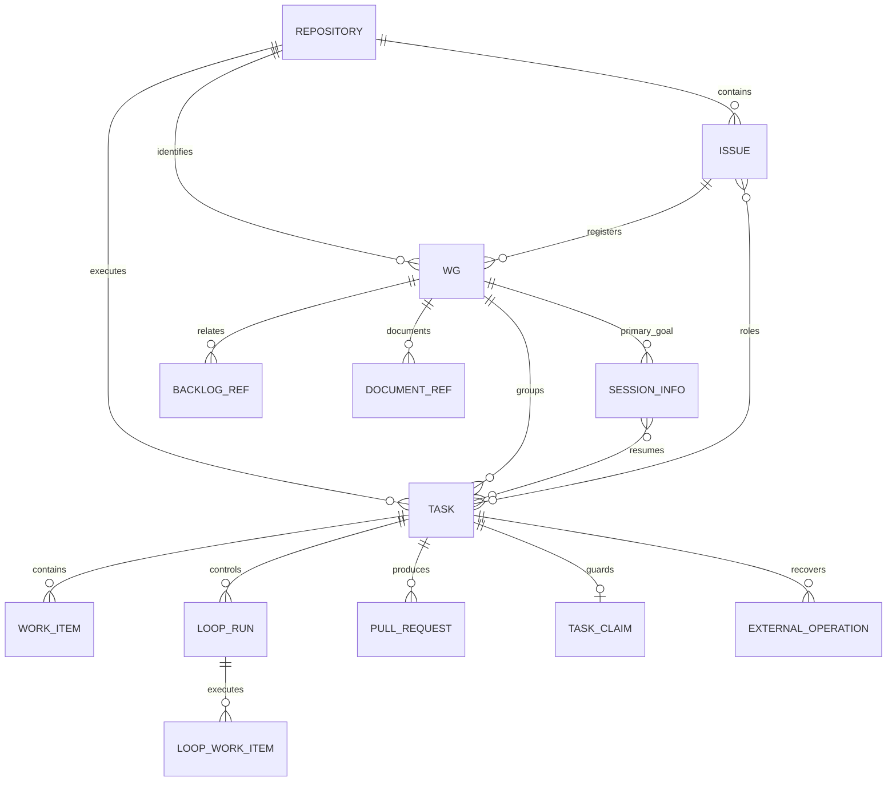
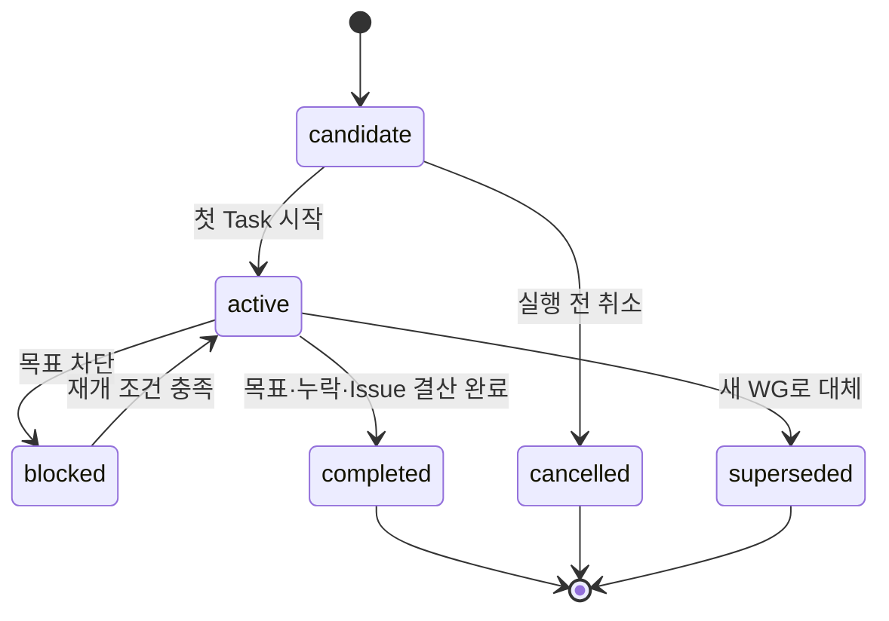
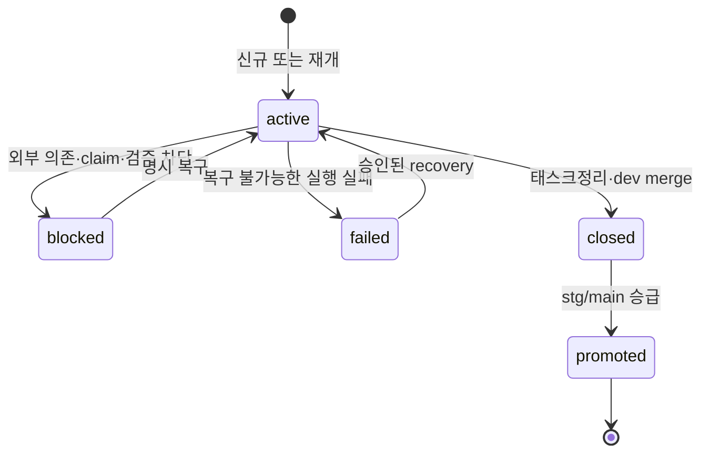

# DSN-013 HCP 작업관리 전략 2.0 설계

| 항목 | 값 |
|---|---|
| 문서 ID | DSN-013 |
| 문서 유형 | 설계 |
| 상태 | Draft |
| 성숙도 | Candidate |
| 버전 | v0.1 |
| 소유자 | jk |
| 작성 에이전트 | Codex |
| 기준 브랜치 | main |
| 작업 브랜치 | task_codex/176-wg-task-work-item-loop-backlog-session-task-session-wg-issue-issue-task-issue-shared-umbrella-repository-registry-wg-counter-task-claim-json-db-dev-stg-prd-backlog |
| 최종 수정일 | 2026-07-31 |
| 관련 Issue | [#176](https://github.com/jkoogit/jkadh/issues/176) |
| 적용 상태 | 제안. 구현·Pilot·활성화 전까지 현행 HCP가 운영 원본 |

## 목차

- [1. 목적](#1-목적)
- [2. 문서 지위와 적용 범위](#2-문서-지위와-적용-범위)
- [3. 현행 기준선과 2.0의 문제 정의](#3-현행-기준선과-20의-문제-정의)
- [4. 용어](#4-용어)
- [5. 설계 불변조건](#5-설계-불변조건)
- [6. 엔터티 관계](#6-엔터티-관계)
- [7. 영구 작업 식별자와 채번](#7-영구-작업-식별자와-채번)
- [8. WG와 Issue 정책](#8-wg와-issue-정책)
- [9. Session과 Task 생명주기](#9-session과-task-생명주기)
- [10. Work Item과 Loop 운영](#10-work-item과-loop-운영)
- [11. Task claim과 동시 작업 통제](#11-task-claim과-동시-작업-통제)
- [12. 운영 원본과 DB 논리 모델](#12-운영-원본과-db-논리-모델)
- [13. JSON에서 DB로의 전환](#13-json에서-db로의-전환)
- [14. 환경별 DB 운영과 복구](#14-환경별-db-운영과-복구)
- [15. GitHub·Git 원격과 DB의 부분 실패 복구](#15-githubgit-원격과-db의-부분-실패-복구)
- [16. Backlog 운영과 마이그레이션](#16-backlog-운영과-마이그레이션)
- [17. 과거 작업 전체 복원](#17-과거-작업-전체-복원)
- [18. 세션정리와 다음 작업 선정](#18-세션정리와-다음-작업-선정)
- [19. 구현·Pilot·활성화 계획](#19-구현pilot활성화-계획)
- [20. 기존 설계와의 관계](#20-기존-설계와의-관계)
- [21. 검증 시나리오와 완료 게이트](#21-검증-시나리오와-완료-게이트)
- [22. 기존 문서 정리 절차](#22-기존-문서-정리-절차)
- [23. 확정 사항과 구현 시 결정 사항](#23-확정-사항과-구현-시-결정-사항)
- [24. 관련 문서](#24-관련-문서)
- [작업 이력](#작업-이력)

## 1. 목적

본 문서는 AI 채팅 단위 작업이 길어지거나 여러 갈래로 분기될 때 목표, 완료 경계와 남은 작업을 잃지 않도록 HCP 작업관리 전략 2.0의 목표 구조를 정의한다.

2.0은 작업관리 제품을 새로 만드는 계획이 아니다. 기존 Harness lifecycle을 유지하면서 다음 문제를 해결하기 위한 운영·데이터 설계다.

- AI 채팅이 끝나도 완료되지 않은 Task를 잃지 않고 다음 Session에서 재개한다.
- 한 Session의 목표와 Task의 독립적인 완료·PR·승급 경계를 구분한다.
- 여러 작업자나 모델이 동시에 실행해도 같은 Task를 중복 변경하지 않게 한다.
- 저장소와 Issue 범위에서 충돌하지 않는 영구 작업 식별자를 제공한다.
- 세션 작업, 전역 Backlog, GitHub Issue, 문서와 DB의 역할을 분리한다.
- 세션정리마다 전체 작업그래프와 우선작업 후보를 현행화한다.

## 2. 문서 지위와 적용 범위

### 2.1 적용 지위

이 문서는 **목표 설계**다. Harness CLI, DB schema와 실제 운영 절차가 구현되고 Pilot과 활성화 게이트를 통과하기 전에는 기존 정책·설계·사용방법과 `.hcp` JSON runtime이 운영 원본이다.

| 상황 | 적용 기준 |
|---|---|
| 구현 전 | 기존 HCP lifecycle과 기존 문서가 운영 원본이다. 본 문서는 구현 범위 결정에 사용한다. |
| 구현 중 | 기존 동작을 회귀 기준으로 유지하고 2.0 기능은 feature flag 또는 전환 모드로 격리한다. |
| Pilot 중 | Pilot 대상에만 2.0 규칙을 적용한다. 비대상 작업은 현행 규칙을 따른다. |
| 활성화 후 | 본 문서와 활성화 시 함께 정리된 정책·사용방법이 운영 원본이 된다. |
| 충돌 시 | 활성화 전에는 기존 문서, 활성화 후에는 활성화 기록에 명시한 문서를 우선한다. |

문서가 독립적으로 이해될 수 있도록 핵심 현행 기준을 요약하지만 기존 문서 전문을 복제하지 않는다. 세부 구현 근거는 관련 문서와 소스에 연결한다.

### 2.2 포함 범위

- Session, SessionInfo, WG, Task, Work Item, Loop, Backlog 용어와 관계
- Session 단일 목표, Task 신규·재개와 다중 Session 지속
- 저장소 registry, WG 식별자와 Issue 내부 순번
- 등록 Issue, 실행 Issue, 관련 Issue의 역할 구분
- 신규 Task의 새 Issue 기본정책과 `shared_umbrella` 예외
- Task claim, 외부 작업 복구 원장과 부분 실패 복구
- JSON/DB write-store 전환과 dev·stg·prd 운영정책
- Backlog 기준정보 마이그레이션과 과거 작업 전체 복원
- 세션정리 작업그래프 현행화, 누락검사, 우선작업 선정과 다음 프롬프트

### 2.3 제외 범위

- Harness CLI와 DB write-store 실제 구현
- DDL, migration, baseline, seed 수정과 실제 DB 명령 실행
- 기존 Backlog 문서의 실제 마이그레이션과 과거 HCP 데이터 적재
- Issue claim과 WG 채번 코드 구현
- PDFowers 소스 또는 다른 타겟서비스 변경
- 세션 024 runtime과 RET-023 소급 수정
- 기존 Deferred Backlog 상태와 재개 조건 변경
- 기존 설계·참고·로드맵 문서와 색인 수정

## 3. 현행 기준선과 2.0의 문제 정의

### 3.1 유지할 현행 lifecycle

현행 Task는 기능을 조각내는 단순 체크리스트가 아니라 독립적인 변경 사이클이다.

```text
#세션시작
→ #태스크시작
→ #태스크처리
→ 필요 시 #루프분석·#루프실행·#루프보완
→ #태스크정리: commit, push, PR, dev merge
→ #태스크승급: stg, main 반영
→ 다음 Task 또는 #세션정리
```

2.0에서도 분석, 구현, 테스트와 문서화는 기본적으로 하나의 Task 안의 Work Item으로 관리한다. 독립 Issue·PR·배포·롤백 경계가 필요한 경우에만 새 Task로 분리한다.

### 3.2 현재 구현과 목표의 차이

| 항목 | 현재 기준선 | 2.0 목표 |
|---|---|---|
| Session | HCP 세션이 AI 채팅과 작업 상태를 함께 보유 | AI 채팅 lifecycle과 지속 작업 lifecycle을 명시적으로 분리 |
| Task 소속 | 하나의 Session JSON 안에 포함 | 여러 Session이 같은 Task를 순차 재개할 수 있는 연결 엔터티 사용 |
| Task 시작 | 신규 생성 중심 | 모든 Session에서 `신규` 또는 `재개` 모드 선택 필수 |
| Session 목표 | 세션명과 Task 범위로 간접 표현 | 하나의 primary WG와 하나의 세션 목표를 구조화 |
| Issue | Session·Task에 단일 연결 번호 중심 | 등록·실행·관련·handoff 역할을 구분 |
| 영구 작업 ID | session·agent 기반 runtime ID | 저장소 key와 등록 Issue 범위의 WG ID |
| 동시 실행 | Loop lease 외 Task 배타 claim 없음 | DB 기반 Task mutate claim과 명시 복구 |
| 작업그래프 | Session 안 Task·Work Item 그래프 | WG부터 Backlog·문서까지 이어지는 프로젝트 그래프 |
| 저장 원본 | `.hcp` JSON | 단계적 dual-write 후 DB primary, JSON snapshot |
| Backlog | 문서 전역 Backlog와 Session runtime Backlog 분리 운영 | 구분을 유지하고 DB에는 추적 기준정보만 적재 |
| 과거 자료 | 회고·Issue·PR·JSON에 분산 | evidence와 신뢰등급을 보존한 전체 복원 |

현재 DB baseline과 migration `007~010`에는 Session, Task, PR, Backlog, Issue와 Branch 테이블이 있다. WG, Repository registry, issue-local counter, Session–Task 다대다 연결, Task claim, Work Item, Loop, 외부 작업 원장은 2.0 후속 설계·구현 대상이다.

## 4. 용어

| 용어 | 정의 | 경계 |
|---|---|---|
| Session | 사용자가 AI와 대화하는 하나의 채팅 단위 작업영역 | 채팅이 끝나면 종료할 수 있다. Task 완료와 동일하지 않다. |
| SessionInfo | Session의 목표, primary WG, 연결 Task, 상태, 시작·종료, 인계와 검증 결과를 저장한 구조화 정보 | Session 자체나 대화 전문이 아니다. 종료 후에도 DB에 보존한다. |
| WG | Work Group. 여러 Session과 Task가 함께 달성할 수 있는 지속적인 작업목표 단위 | 프로젝트·에픽 전체가 아니라 하나의 명확한 목표와 종료조건을 가진다. |
| Task | 하나의 독립적인 변경 사이클 | `태스크시작→처리→정리→승급` 전체를 소유한다. 여러 Session에 걸칠 수 있다. |
| Work Item | Task 안에서 수행할 분석·구현·검증·문서화 등의 세부 작업 | 독립 PR·승급 경계가 없으며 Task가 소유한다. |
| Loop | 반복 탐구·구현·검증·보완이 필요한 Work Item 집합의 실행 인스턴스 | Task를 대체하지 않으며 원격 반영 권한이 없다. |
| Session Backlog | 현재 Session에서 발견했지만 Task에 포함하지 않은 미해결 후보 | SessionInfo에 연결하며 전역 Backlog와 구분한다. |
| 전역 Backlog | 저장소 차원의 미해결·Deferred 작업 목록 | 장기 상태와 재개 조건을 가지며 Session 종료와 독립적이다. |
| Repository | Issue, PR, branch와 문서가 속한 원격 저장소 | 불변 `repositoryKey`와 원격 좌표를 registry로 관리한다. |
| Coordination Repository | WG 등록 Issue와 목표·조정 evidence를 소유하는 저장소 | WG ID의 `repositoryKey`는 이 저장소 key다. |
| Execution Repository | Task 코드·문서 변경, 실행 Issue, branch와 PR을 소유하는 저장소 | Task마다 정확히 하나를 지정하며 WG 저장소와 다를 수 있다. |
| 등록 Issue | WG의 등록·조정 기준이 되는 원격 저장소 Issue | WG ID의 Issue 번호로 사용한다. |
| 실행 Issue | 한 Task의 범위·완료·검증을 소유하는 원격 저장소 Issue | 신규 Task는 새 실행 Issue가 기본이다. |
| 관련 Issue | Task나 WG에 참고·의존·handoff로 연결된 Issue | 등록·실행 Issue와 역할을 섞지 않는다. |
| Task claim | 특정 Session이 Task를 변경할 수 있도록 획득하는 배타 실행권 | 사용자·모델 식별자가 아니라 Session과 lease token으로 검증한다. |
| Task checkpoint | 미완료 Task를 다음 Session에서 안전하게 재개하기 위한 branch·commit·작업트리·검증 snapshot | 태스크정리, PR 또는 승급 evidence가 아니다. |
| 외부 작업 복구 원장 | GitHub Issue·PR 등 DB 밖 쓰기의 의도, 실행, 결과와 재조정 상태 기록 | 중복 생성과 부분 성공을 복구한다. |
| 작업그래프 | WG, Task, Work Item, Loop, Backlog, Issue, PR, 문서의 상태와 관계 | 현재 현황은 RDM-005에서 관리한다. |

에이전트명, 모델명과 사람 사용자 식별정보는 감사용 선택 메타정보일 수 있지만 영구 ID, 소유권 또는 실행 권한의 근거로 사용하지 않는다.

## 5. 설계 불변조건

1. 하나의 Session은 하나의 명시적인 목표를 가지며 첫 `#태스크시작` 이후 정확히 하나의 primary WG에 연결된다.
2. 모든 새 Session은 `#세션시작` 뒤 `#태스크시작`을 실행하고 `신규` 또는 `재개`를 명시한다.
3. 하나의 Session에는 완료된 Task가 여러 개 있을 수 있지만 동시에 변경 가능한 active Task는 최대 하나다.
   순차 Task는 모두 같은 primary WG 목표에 기여해야 하며 목표가 달라지면 현재 Session을 인계·종료하고 새 Session을 시작한다.
4. 하나의 Task는 여러 Session에 걸쳐 진행할 수 있으며 Session 종료만으로 완료되지 않는다.
5. Task는 현행 전체 lifecycle을 유지한다. 분석·구현·검증을 각각 새 Task로 자동 분리하지 않는다.
6. 독립적인 완료·Issue·PR·배포·롤백 경계가 생기면 새 Task와 새 실행 Issue를 기본으로 한다.
7. Task를 재개할 때 새 Task, Issue 또는 branch를 만들지 않는다.
8. Task의 논리적 오너십은 terminal 상태까지 유지하되 active claim은 Session 단위 lease다. 정상 Session 종료에서는 checkpoint 뒤 claim을 해제하고 다음 Session의 명시적 `재개`가 새 claim을 획득한다. 자동 claim 탈취는 금지한다.
9. 사용자나 모델 식별정보를 영구 ID에 넣지 않는다.
10. WG·Task·Issue 번호는 삭제·취소·실패 후에도 재사용하지 않는다.
11. GitHub는 Issue·PR 내용과 원격 상태의 원본이고 DB는 관계·실행상태·복구 원본이다.
12. 문서는 설명과 결정의 원본이고 DB에는 추적에 필요한 기준정보와 문서 참조만 저장한다.
13. DB primary 활성화 후 DB 장애 중 변경 작업은 fail-closed한다.
14. Deferred 전역 Backlog는 재개 조건이 충족되거나 사용자가 명시 선택하기 전까지 즉시 다음 작업에서 제외한다.
15. 세션정리 성공 전에 작업 누락, Issue 결산과 실행 가능한 다음 프롬프트를 검증한다.
16. 신규 Task는 clean한 최신 기준 branch에서 시작하고, 재개 Task만 검증된 기존 branch·작업트리를 이어간다.

## 6. 엔터티 관계



| 관계 | 목표 cardinality | 규칙 |
|---|---:|---|
| Repository–WG | 1:N | 모든 WG는 하나의 불변 repository key에 속한다. |
| Repository–Task | 1:N | 모든 Task는 하나의 execution repository에 속한다. WG의 coordination repository와 달라도 된다. |
| 등록 Issue–WG | 1:N | 신규 독립 목표는 1:1이 기본이다. 승인된 `shared_registration` 예외에서만 같은 등록 Issue 아래 여러 WG를 두고 issue-local 순번으로 구분한다. |
| WG–Task | 1:N | 하나의 지속 목표를 여러 독립 Task로 나눌 수 있다. |
| WG–SessionInfo | 1:N | 여러 채팅 Session이 같은 WG를 이어갈 수 있다. |
| SessionInfo–Task | N:M | Task 재개 이력을 연결 엔터티로 남긴다. 한 시점의 active 연결은 제한한다. |
| Task–Work Item | 1:N | 세부 작업은 Task 완료 경계 안에 둔다. |
| Task–Loop | 1:N | Task마다 0개 이상의 Loop가 가능하지만 변경 중인 Loop는 최대 하나다. |
| Task–Issue | N:M | 역할 컬럼으로 registration, execution, related, handoff를 구분한다. |
| Task–PR | 1:N | 보완 PR이 가능하되 태스크정리 결과와 승급 기준 PR을 식별한다. |
| Task–claim | 1:0..1 | 활성 mutate claim은 하나만 허용한다. |

SessionInfo–Task 연결에는 `new`, `resume`, `observe`, `handoff` 역할, 접근모드 `mutate|read_only`, 연결 시각, 해제 시각과 인계 snapshot을 기록한다. 이 연결이 현재 `harness_task.session_id`의 단일 소속 제약을 대체한다.

WG의 `repository_id`는 coordination repository를 가리키고 Task의 `repository_id`는 execution repository를 가리킨다. Issue, PR과 branch의 외부 식별자는 번호만 저장하지 않고 최소 `(provider, repository_id, number|name)` 복합 key로 검증한다. JKADH에서 조정하고 PDFowers에서 실행하는 작업은 하나의 WG 아래 저장소별 Task·Issue·PR로 분리한다.

## 7. 영구 작업 식별자와 채번

### 7.1 Repository registry

각 저장소는 사람이 읽을 수 있고 변경되지 않는 `repositoryKey`를 갖는다.

| 필드 | 예 | 기준 |
|---|---|---|
| `repositoryKey` | `JKADH` | 대문자 영숫자와 하이픈, 생성 후 변경 금지 |
| provider | `github` | 원격 제공자 |
| owner/name | `jkoogit/jkadh` | 원격 좌표. 이전 이력 보존 가능 |
| canonical URL | `https://github.com/jkoogit/jkadh` | 표시·검증용 |
| lifecycle policy | `dev→stg→main` | 저장소별 정책 참조 |
| status | `active` | 폐기해도 key 재사용 금지 |

원격 저장소 rename이나 transfer가 발생해도 `repositoryKey`는 유지하고 원격 좌표 이력을 추가한다.

### 7.2 WG ID

영구 WG ID는 다음 형식을 사용한다.

```text
WG-{repositoryKey}-{등록 Issue 번호}-{Issue 내 3자리 순번}
```

예:

```text
WG-JKADH-176-001
```

이 형식은 중앙 전역 순번 없이도 저장소, 조정 Issue와 Issue 내부 등록 순서를 식별한다. ID만으로 실제 시간 선후, 사람, 모델 또는 현재 실행주체를 추론하지 않는다. 선후관계는 `createdAt`, 의존 edge와 event sequence로 판단한다.

### 7.3 Issue 내부 순번 취득

DB가 다음 원자적 절차를 수행한다.

1. `(repository_id, registration_issue_number)` counter row를 잠근다.
2. `last_sequence + 1`을 예약하고 counter를 증가시킨다.
3. 같은 transaction에서 WG row와 allocation event를 생성한다.
4. unique `(repository_id, registration_issue_number, issue_sequence)`로 중복을 차단한다.
5. transaction commit 뒤 GitHub 표시를 시도한다.

GitHub 댓글은 감사·가시성 mirror일 뿐 채번 원본이 아니다. 취소·실패·부분 생성된 번호는 tombstone으로 남기며 재사용하지 않는다. 번호 간격은 허용한다.

#### 7.3.1 등록 Issue 선행생성과 2단계 ID 확정

WG ID에는 원격 Issue 번호가 들어가므로 신규 WG는 Issue보다 먼저 영구 ID를 가질 수 없다. 다음 순서로 생성한다.

```text
DB에 registration Issue 생성 intent와 externalOperationId 기록
→ 영구 WG ID 없이 idempotency marker를 포함해 GitHub Issue 생성
→ 생성된 repository·Issue 번호를 DB intent에 확정
→ 같은 Issue 범위 counter transaction으로 WG ID 할당
→ WG row·allocation event·Issue role 확정
→ Issue에 최소 WG 식별 표시를 동기화
```

첫 등록 Issue가 첫 Task의 실행 Issue도 겸하면 Issue를 두 개 만들지 않는다. 하나의 외부 작업 결과를 `registration`과 `execution` 두 역할에 연결한 뒤 WG ID를 할당하고, 같은 Issue 번호 범위에서 Task ID를 별도 할당한다. 실행 Issue를 분리하는 정책이면 등록 Issue와 WG를 먼저 확정한 뒤 별도의 실행 Issue 생성 intent를 수행한다.

GitHub Issue 생성 뒤 DB 확정이 실패하면 Issue를 즉시 다시 만들지 않는다. `externalOperationId`와 원격 Issue 번호를 외부 작업 복구 원장에 남기고 같은 intent를 재개한다. DB allocation 뒤 GitHub 표시가 실패하면 WG ID를 취소하지 않고 표시 동기화만 재시도한다.

#### 7.3.2 즉시 확정과 세션정리 현행화의 경계

채번 직후 모든 표시 문서를 전면 수정할 필요는 없다. 다음 세 수준을 구분한다.

| 대상 | 시점 | 기준 |
|---|---|---|
| DB WG ID·Issue role·allocation event | 채번 transaction에서 즉시 | 이후 명령과 다른 Session이 참조하는 운영 원본 |
| 현재 SessionInfo·명령 응답 | 채번 성공 즉시 | 사용자가 현재 ID와 역할을 확인할 수 있어야 함 |
| GitHub Issue 최소 식별 표시 | 채번 직후 best-effort | WG ID, 상태, canonical graph 참조만 idempotent 댓글 또는 구조화 영역으로 표시 |
| Issue 본문·RDM-005·작업그래프 종합 현황 | checkpoint와 세션정리 | Task·PR·keep·handoff 결과까지 묶어 한 번에 현행화 |

기본 정책은 **내부 원장 즉시 확정, 원격 최소 표시는 즉시 시도, 종합 현행화는 세션정리**다. 최소 표시 실패는 external operation의 `pending_sync`로 남긴다. 다른 Session이 해당 WG를 변경하기 전과 세션정리 성공 전에는 반드시 재조정하며, 실패한 표시를 숨긴 채 세션을 완료하지 않는다. 이 정책은 Issue 본문을 채번마다 반복 편집하는 비용과 세션 중 WG가 보이지 않는 위험을 함께 줄인다.

### 7.4 Task ID와 기술 식별자

WG ID는 사람이 추적하는 지속 목표 식별자이고 Task ID는 독립 변경 lifecycle의 영구 식별자다. Task ID는 다음 형식을 사용한다.

```text
TSK-{executionRepositoryKey}-{실행 Issue 번호}-{Issue 내 3자리 순번}
```

예:

```text
TSK-PDFOWERS-415-001
```

신규 Task가 새 실행 Issue를 사용하는 기본 경로에서는 마지막 순번이 보통 `001`이다. `shared_umbrella` 예외나 복원 자료처럼 같은 실행 Issue 아래 여러 Task가 존재할 때 순번을 증가시킨다. DB는 WG counter와 같은 원자 할당·unique·tombstone 원칙으로 Task issue-local counter를 관리한다.

Session, Work Item, Loop와 event의 DB primary key는 의미를 과도하게 넣지 않은 불투명 식별자를 사용한다. 현재 `codex_task_*`, `codex_ses_*` ID는 과거 호환 식별자로 보존하고 restore ledger에서 새 Task ID에 연결한다. 사용자·모델·시간 문자열은 ID 충돌 방지나 권한 근거로 사용하지 않는다.

## 8. WG와 Issue 정책

### 8.1 Issue 역할

| 역할 | 목적 | WG ID 사용 | 기본 개수 |
|---|---|---:|---:|
| `registration` | WG 목표·범위·조정과 Task 목록 | 사용 | WG당 1 |
| `execution` | Task 완료조건·검증·PR·결산 | 사용하지 않음 | Task당 1 |
| `related` | 의존·참고·차단 근거 | 사용하지 않음 | 0..N |
| `handoff` | 중단 Task를 새 실행 경계로 넘김 | 사용하지 않음 | 0..N |

등록 Issue와 첫 실행 Issue는 같을 수 있다. 후속 Task가 독립 경계를 가지면 같은 WG 안에서도 새 실행 Issue를 만든다.

### 8.1.1 등록 Issue 공유 정책

신규 독립 목표는 새 등록 Issue 하나와 WG 하나를 만드는 것이 기본이며 첫 WG 순번은 보통 `001`이다. 이미 존재하는 업무접수·umbrella Issue 아래 여러 WG를 등록하는 것은 다음 조건을 모두 만족하는 `shared_registration` 예외다.

- `issuePolicy=shared_registration`
- 공유 Issue가 여러 지속 목표를 조정해야 하는 이유
- WG별 범위·완료조건·Task 목록과 결산 방법
- 사용자 명시 승인
- 기존 active WG와 목표·claim·실행 Issue가 충돌하지 않는다는 증거

조건이 없으면 진행 중 등록 Issue를 편의상 재사용하지 않고 새 등록 Issue 생성을 제안한다. 따라서 등록 Issue–WG cardinality는 기술적으로 1:N을 지원하지만 운영 기본은 1:1이다.

### 8.2 신규·재개 판단

| 질문 | 예 | 판단 |
|---|---|---|
| 기존 Task의 완료조건과 branch를 그대로 이어가는가? | 다음 Session에서 미완료 구현 계속 | `재개`, 기존 실행 Issue 사용 |
| 독립 완료·PR·배포·롤백이 가능한가? | 별도 기능, migration, 서비스 변경 | `신규`, 새 실행 Issue 기본 |
| 기존 Task의 필수 오류 수정인가? | 테스트 실패, 데이터 손실 방지 | 기존 Task에서 보완 |
| 완료조건을 넓히는 편의 개선인가? | 일반화, UX 개선, 장기 최적화 | 다음 Task 또는 Backlog |
| 하나의 umbrella Issue가 승인된 작은 Task들을 명시적으로 묶는가? | 문서 정리 묶음 | 사용자 승인 후 `shared_umbrella` 예외 |

### 8.3 `shared_umbrella` 예외

새 Task가 기존 실행 Issue를 공유하려면 다음을 모두 기록한다.

- `issuePolicy=shared_umbrella`
- 공유 이유와 독립 완료조건
- Task별 branch·PR·결산 구분 방법
- 사용자 명시 승인
- 동시 active Task 금지 또는 충돌 없는 경로 증거

조건이 없으면 Harness는 신규 Task 시작을 fail-closed하고 새 Issue 생성을 제안한다. 자연어 의미만으로 독립성을 완전히 자동 판정할 수 없으므로 구조 검증과 사용자 판단을 함께 사용한다.

### 8.4 실행 소유권 교체

시작된 Task는 terminal 상태까지 오너십을 유지한다. 다른 실행주체로 교체해야 하면 기존 Task와 실행 Issue를 `blocked` 또는 `superseded`로 결산하고 새 Task·새 실행 Issue를 만드는 것이 기본이다. 단순한 채팅 단절이나 동일 작업 재접속은 교체가 아니라 명시 복구 후 `재개`다.

### 8.5 WG 생명주기와 등록 Issue 결산

WG는 Task의 promoted 여부만으로 자동 완료되지 않는다.



WG를 `completed`로 전환하려면 다음을 모두 충족한다.

- WG 완료조건이 검증됐다.
- 모든 필수 Task가 `promoted` 또는 근거 있는 terminal 상태다.
- 미완료 Work Item·Loop·discovery가 Task, Backlog 또는 취소로 분류됐다.
- 관련 실행 Issue와 PR이 결산됐다.
- 작업그래프와 문서 snapshot이 최종 상태를 반영한다.

등록 Issue 결산은 WG 상태와 분리해 기록한다.

| WG 결과 | 등록 Issue 결정 | 기준 |
|---|---|---|
| `completed` | `close` | 남은 후속이 없고 원격 CLOSED를 검증 |
| `active` 또는 `blocked` | `keep` | 이유, 재개 조건과 다음 Task를 기록 |
| `superseded` | `handoff` | 새 WG·등록 Issue와 대체 관계를 기록 |
| `cancelled` | `close` 또는 `handoff` | 취소 사유와 잔여 항목의 귀속을 기록 |

등록 Issue가 첫 실행 Issue를 겸하면 Task 결산과 WG 결산을 각각 충족한 뒤 닫는다. 일부 Task만 끝난 상태에서는 실행 범위가 완료됐더라도 등록 역할 때문에 Issue를 `keep`할 수 있다.

## 9. Session과 Task 생명주기

### 9.1 Session 시작

```text
#세션시작
→ 설정·Repository·SessionInfo·active claim·우선 후보 1회 조회
→ 하나의 Session 목표 확인
→ #태스크시작{mode: 신규|재개, ...}
```

세션시작은 Task를 자동 생성하거나 처리하지 않는다. 대신 다음 `#태스크시작` 프롬프트를 실제 후보 값으로 생성한다. 후보가 없거나 원격·DB 리뷰가 unavailable이면 실행 프롬프트를 억제한다.

### 9.2 `#태스크시작` 신규 모드

1. 기존 primary WG를 선택하거나 신규 등록 Issue 생성 intent를 기록한다.
2. 신규 WG이면 등록 Issue를 선행 생성하고 7.3의 2단계 절차로 WG ID를 확정한다.
3. 실행 Issue 정책을 검증하고, 등록 Issue 겸용 또는 별도 실행 Issue 중 승인된 경로를 확정한다.
4. 실행 Issue 번호 범위 counter로 Task ID를 할당하고 Session–Task `new` 연결을 생성한다.
5. Task claim을 획득한다.
6. 저장소 정책에 맞는 branch를 생성한다.
7. 범위·제외범위·완료조건·검증방법을 동결 가능한 초안으로 저장한다.
8. Loop 적합성을 분석해 `권장`, `조건부 권장`, `불필요` 중 하나를 보고한다.

### 9.3 `#태스크시작` 재개 모드

1. 기존 WG·Task·실행 Issue·branch와 미완료 Work Item을 조회한다.
2. Task가 terminal이 아니고 다른 유효 mutate claim이 없는지 확인한다.
3. 이전 Session의 인계·실패·누락·검증과 Task checkpoint를 표시한다.
4. 명시 복구가 필요하면 recovery 절차를 먼저 수행한다.
5. `resume_same_workspace` preflight로 등록 branch, 기준 commit, 작업트리와 diff digest를 검증한다.
6. 새 Task·Issue·branch를 만들지 않고 Session–Task `resume/mutate` 연결과 claim을 생성한다.
7. 현재 범위와 남은 작업으로 실행 가능한 `#태스크처리` 프롬프트를 만든다.

사용자가 신규·재개를 판단하기 어렵지 않도록 Harness가 후보와 근거를 먼저 제시하되, 실행은 `#태스크시작` 태그로만 수행한다.

### 9.4 read-only observe

상태 확인·리뷰만 필요한 Session도 `#세션시작` 뒤 `#태스크시작`을 생략하지 않는다. 다음처럼 기존 Task에 read-only로 연결한다.

```text
#태스크시작{mode: 재개, access: observe, taskId: ...}
```

`observe`는 Session–Task 관계 역할이고 Task lifecycle 모드는 `재개`다. observe Session은 mutate claim을 획득하지 않으며 코드·문서·HCP 상태·Issue·PR을 변경할 수 없다. 유효 claim이 있는 동안에도 snapshot 조회는 가능하지만 stale 여부와 claim 보유 Session을 표시한다. 변경이 필요하면 별도의 tagged 요청으로 `mutate` 전환을 요청하고, 활성 claim·checkpoint·scope gate를 다시 통과해야 한다.

### 9.5 Task 상태

현재 상태 `active`, `closed`, `promoted`, `blocked`, `failed`를 호환 기준으로 유지한다. 2.0에서는 상태와 phase를 분리한다.



`discovering`, `implementing`, `stabilizing`, `close_ready`는 Task phase로 사용한다. `cancelled`, `superseded`가 필요하면 구현 시 terminal 상태로 추가하되 기존 `deleted`와 의미를 구분한다. 삭제는 식별자와 event를 제거하지 않는 논리 삭제다.

### 9.6 Session 종료와 미완료 Task

Session은 다음처럼 Task와 독립적으로 닫을 수 있다.

```text
AI 채팅 Session = complete
SessionInfo workOutcome = continued | completed | blocked
Task = active | blocked | closed | promoted | failed
```

Task가 미완료면 세션정리에서 다음을 필수로 저장한다.

- 현재 Task 상태·phase·claim 해제 또는 인계 상태
- 완료·미완료 Work Item과 필수 Loop 상태
- 마지막 검증 결과와 작업트리·branch·commit
- 실행 Issue와 `close`, `keep`, `handoff` 결정
- 다음 Session의 `#태스크시작{mode: 재개}` 프롬프트

미완료 Task의 Session을 정상 종료할 때에는 checkpoint 저장이 성공한 뒤 active claim을 `released`로 전환한다. Task의 논리적 오너십과 실행 Issue는 유지한다. checkpoint 저장이나 digest 검증이 실패하면 Session 종료를 차단하고 claim을 유지한다.

SessionInfo는 Session 종료 후에도 삭제하지 않는다. 다음 Session은 DB에서 이 snapshot을 조회해 Task를 재개한다.

### 9.7 미완료 변경 checkpoint와 재개 preflight

초기 2.0은 같은 저장소 작업공간에서 채팅 Session만 바뀌는 `resume_same_workspace`를 기본으로 한다.

| checkpoint 필드 | 목적 |
|---|---|
| execution repository·Task branch | 재개 대상 고정 |
| base commit·HEAD commit | 변경 기준과 현재 Git 위치 |
| tracked/untracked/ignored 분류 | 허용 runtime과 실제 작업 변경 구분 |
| changed path 목록·diff digest | 인계 뒤 변경·누락·혼입 탐지 |
| 마지막 검증과 Work Item·Loop 상태 | 안전한 재개 지점 |
| checkpoint version·recordedAt | stale 재개 차단 |

재개 preflight는 신규 시작과 다르게 동작한다.

| 모드 | branch 기준 | 작업트리 기준 | 결과 |
|---|---|---|---|
| `신규` | 최신 허용 기준 branch에서 새 Task branch 생성 | tracked clean 필수 | 기존 Task branch·dirty 변경을 이어받지 않음 |
| `재개/same_workspace` | checkpoint의 기존 Task branch | 저장된 path·diff digest와 정확히 일치 | 일치하면 claim 획득, 다르면 recovery 필요 |
| `재개/portable` | 별도 portable checkpoint ref | checkpoint artifact 검증 | 전용 기능 구현 전까지 fail-closed |

`resume_same_workspace` checkpoint는 Git commit을 만들지 않는 상태 evidence이므로 현행 `#태스크정리`의 commit 권한을 침해하지 않는다. 다른 작업공간이나 실행기로 이동하려면 변경을 안전하게 운반할 portable checkpoint가 필요하다. 이 기능은 전용 Task에서 draft commit/ref 또는 서명된 patch artifact 중 하나를 선택하고, 구현 전까지 cross-workspace 재개를 허용하지 않는다. portable checkpoint도 PR·dev merge·Task close·승급으로 취급하지 않는다.

## 10. Work Item과 Loop 운영

### 10.1 Work Item

Work Item은 분석, 설계, 구현, 테스트, 문서, 검토처럼 Task를 완성하는 세부 작업이다. `parentId`, `derivedFromId`, `dependsOnIds`로 계층·파생·의존관계를 표현한다.

현재 상태 `candidate`, `ready`, `active`, `done`, `blocked`, `deferred`, `cancelled`, `backlogged`를 유지한다. 세션정리에서 `done`, 근거가 있는 `cancelled`, 연결 증거가 있는 `backlogged`만 종결로 인정한다.

### 10.2 추가 발견의 분류

`#태스크처리`는 반복할 수 있다. 보완 검토에서 발견한 항목은 다음 중 하나로 반드시 분류한다.

| 분류 | 기준 | 처리 |
|---|---|---|
| `current_task` | 현재 완료조건 충족, 오류·거짓 성공·데이터 손실 방지에 필수 | 현재 Work Item 또는 보완 Work Item |
| `next_task` | 독립 완료·PR·롤백 경계 | 새 Task 후보 |
| `backlog` | 즉시 실행 근거가 없거나 재개 조건 대기 | Session 또는 전역 Backlog 후보 |
| `cancelled` | 중복·오해·채택 제외 | 근거와 함께 종결 |

미분류 발견 항목은 태스크정리를 차단한다. 더 좋아질 수 있다는 이유만으로 현재 Task 범위를 무한 확장하지 않는다.

### 10.3 Loop 적용

Task 시작 분석에서 다음 조건을 확인해 Loop를 제안한다.

- 완료조건이 탐구를 통해 반복 개정될 가능성이 높다.
- 여러 Work Item의 의존 순서와 checkpoint가 필요하다.
- 구현·검증·보완을 반복하며 중단·복원·롤백 상태를 보존해야 한다.
- 같은 실패의 재시도 제한과 evidence가 필요하다.

작은 문서 수정, 단일 구현과 검증처럼 한 번의 처리로 충분하면 Loop를 만들지 않는다. Task는 `0..N` Loop를 가질 수 있지만 동시에 소스를 변경하는 Loop는 하나만 허용한다. Loop는 commit, PR, merge와 승급을 수행하지 않는다.

## 11. Task claim과 동시 작업 통제

### 11.1 claim 기준

Task 변경 명령은 DB의 활성 claim을 요구한다.

| 필드 | 의미 |
|---|---|
| `task_id` | 보호 대상 Task |
| `session_id` | 현재 변경권을 가진 SessionInfo |
| `claim_token` | 명령마다 검증할 불투명 token |
| `version` | optimistic concurrency version |
| `acquired_at` | 획득 시각 |
| `heartbeat_at` | 마지막 정상 실행 시각 |
| `expires_at` | crash 판단을 위한 lease 만료 시각 |
| `status` | active, released, expired, recovered, revoked |

사용자명, 모델명과 agent label은 claim 판정에 사용하지 않는다.

### 11.2 충돌 처리

- 유효한 claim이 있는 Task·실행 Issue를 다른 Session이 신규 작업으로 시작하면 차단한다.
- Session이 같은 Task를 재개하려면 기존 claim이 정상 해제됐거나 명시 recovery로 만료 처리돼야 한다.
- lease 만료만으로 즉시 탈취하지 않는다. 마지막 event, branch, 작업트리와 외부 작업 원장을 검토한다.
- 서로 다른 Task라도 같은 branch 또는 충돌 경로를 변경하면 저장소 수준 gate로 차단한다.
- 동일 Issue를 공유하는 `shared_umbrella` Task는 동시 active를 기본 금지한다.
- `observe/read_only` 연결은 claim을 만들지 않으며 mutate 명령을 허용하지 않는다.
- 정상 Session 종료는 checkpoint와 SessionInfo 인계가 같은 transaction에서 확정된 뒤 claim을 `released`로 전환한다.

### 11.3 crash와 복구

1. claim을 `recovery_required` 후보로 표시한다.
2. 마지막 DB event, JSON mirror, Git commit, 작업트리, Issue·PR 상태를 비교한다.
3. 완료된 외부 action은 반복하지 않는다.
4. 사용자가 복구 대상을 승인하면 기존 claim을 `recovered`로 종결한다.
5. 새 Session claim과 `resume` 연결을 생성한다.

자동 steal, 사용자 추정, 모델명 일치만으로 복구하는 방식은 금지한다.

## 12. 운영 원본과 DB 논리 모델

### 12.1 원본 책임

| 정보 | 운영 원본 | DB 역할 |
|---|---|---|
| Issue·PR 본문과 원격 상태 | GitHub | key, role, snapshot, 동기화 상태 |
| branch·commit·diff | Git | 관계, 기준 SHA, 검증 evidence |
| 정책·설계·회고·Backlog 설명 | Git 문서 | path, document ID, commit, hash, 상태 기준정보 |
| WG·SessionInfo·Task·Work Item·claim | DB primary 활성화 후 DB | 실행·관계·이력 원본 |
| 대화 전문 | AI 채팅 시스템 | 필요한 결정·인계만 SessionInfo에 요약 |
| `.hcp` JSON | 전환 단계의 원본 또는 DB mirror | fallback·snapshot·복구 evidence |

DB에 문서 전문이나 사용자 식별정보를 복제하지 않는다. 문서 경로, ID, 상태, 우선순위, 재개 조건 요약, 관련 entity와 검증 hash만 저장한다.

### 12.2 목표 논리 엔터티

정확한 테이블명과 DDL은 후속 구현 설계에서 확정한다.

| 논리 엔터티 | 주요 책임 | 현재 기반 |
|---|---|---|
| Repository registry | 불변 key, 원격 좌표와 lifecycle 정책 | ProjectProfile 확장 필요 |
| WG | 영구 업무 ID, 목표·상태·등록 Issue | 신규 |
| WG counter | Issue-local 순번 원자 할당 | 신규 |
| Task counter | 실행 Issue-local Task 순번 원자 할당 | 신규 |
| SessionInfo | 채팅 lifecycle, primary WG, 인계 snapshot | `harness_session` 확장 |
| Session–Task | new/resume/observe/handoff 연결 | 신규 |
| Task | 독립 변경 lifecycle과 실행 Issue | `harness_task` 확장 |
| Task checkpoint | same-workspace 재개 기준과 portable 여부 | 신규 |
| Task–Issue role | registration/execution/related/handoff | `harness_issue` 확장 또는 연결 테이블 |
| Work Item | Task 세부 그래프와 evidence | JSON 모델의 DB 이관 |
| Loop Run | 반복 실행·lease·outcome | JSON 모델의 DB 이관 |
| Task claim | 배타 변경권과 recovery | 신규 |
| Backlog reference | Session/전역 구분, 문서 참조와 재개 조건 | `harness_backlog_item` 확장 |
| External operation | GitHub 쓰기 intent·idempotency·복구 | 신규 |
| Pending-sync outbox | JSON primary 중 DB 미적재 mutation 재생 | JSON runtime 확장 후 DB confirm |
| Graph revision | projection의 기준 event와 compare-and-set version | 신규 |
| Document reference | 문서 ID·path·commit·hash | 신규 또는 기존 후보 확장 |
| Restore ledger | 과거 자료 source·신뢰등급·검토상태 | 신규 |

### 12.3 Session 시작의 1회 메타 조회

세션시작은 최소 한 번 다음 snapshot을 일관된 읽기로 조회한다.

- Repository 설정과 branch lifecycle
- 종료되지 않은 SessionInfo와 Task·claim
- 선택 가능한 WG와 Backlog 후보
- 직전 Session 인계와 Issue·PR 결산 상태
- pending outbox와 미완료 external operation
- WG·Task의 Issue 최소 표시 `pending_sync`
- reconciliation conflict와 DB primary rollback fence
- DB write-store 모드와 schema version
- 작업그래프 최신 snapshot version

조회 결과는 현재 Session의 Task 후보를 만들기 전에 다음과 같이 분류한다.

| 발견 상태 | 세션시작 처리 |
|---|---|
| 일반 mutation의 단순 pending outbox, 현재 후보와 무관 | 경고와 reconcile 후보를 표시하되 read-only 탐색은 허용 |
| 현재 WG·Task와 관련된 counter·claim projection 미완료 | 신규·재개 프롬프트를 억제하고 동일 `operationKey` 복구를 우선 제안 |
| 미완료 Issue·PR·push external operation 또는 Issue 최소 표시 | 원격 객체를 marker로 재조회하고 confirm·표시 복구 전 관련 mutate 진입 차단 |
| reconciliation conflict | 자동 재생을 금지하고 사용자 결산 요청 |
| rollback fence 활성 | 모든 mutate 프롬프트를 억제하고 fence 절차의 다음 단계만 제안 |

다른 WG·Task의 단순 outbox 때문에 저장소 전체 read-only 조회를 막지는 않는다. 그러나 현재 후보의 식별자·권한·외부 부작용이 미확정이면 신규 작업보다 복구가 우선한다. 이후 변경 명령은 snapshot만 믿지 않고 transaction 안에서 version, claim, 관련 pending operation을 다시 확인한다.

## 13. JSON에서 DB로의 전환

### 13.1 저장 모드

DSN-010의 네 모드를 유지한다.

| 모드 | JSON 쓰기 | DB 쓰기 | 읽기 원본 | 변경 실패 기준 |
|---|---:|---:|---|---|
| `json-only` | Y | N | JSON | 현행 기준 |
| `dual-write-json-primary` | Y | Y | JSON | DB 실패 경고·재조정 대상으로 기록 |
| `db-primary-json-mirror` | Y | Y | DB | DB 실패 시 변경 fail-closed |
| `db-only` | N | Y | DB | 별도 승인 전 사용하지 않음 |

중요한 변경은 DB primary 전환 후의 장애 정책이다. DSN-010의 즉시 `json-only` fallback은 JSON primary·shadow 단계에는 유효하지만, 다중 Session·claim·counter를 DB가 소유한 뒤 자동 강등하면 split-brain이 발생한다. 따라서 DB primary 활성화 후에는 자동 JSON 변경 fallback을 금지한다.

#### 13.1.1 저장 모드별 2.0 capability

읽기 원본과 동시성 권한 원본은 다를 수 있다. `dual-write-json-primary`에서도 WG/Task counter와 claim은 DB의 동기 성공이 있어야만 유효하다.

| 모드·상태 | 기존 단일 Session HCP 변경 | 신규 WG·Task ID | Task mutate claim·다중 Session 재개 | 2.0 판단 |
|---|---:|---:|---:|---|
| `json-only` | Y | N | N | legacy HCP만 허용 |
| `dual-write-json-primary`, DB 정상 | Y | Y | Y | 제한된 2.0 Pilot 허용. JSON은 상태 읽기 원본, DB는 counter·claim 권한 원본 |
| `dual-write-json-primary`, DB 장애 | 정책으로 허용된 legacy 변경만 가능 | N | N | 2.0 식별·동시성 기능 fail-closed |
| `db-primary-json-mirror`, DB 정상 | Y | Y | Y | 전체 2.0 기능 허용 |
| `db-primary-json-mirror`, DB 장애 | N | N | N | snapshot 조회·보고만 허용 |
| `db-only` | 별도 승인 전 N | 별도 승인 전 N | 별도 승인 전 N | 운영 대상 아님 |

이 표는 저장 모드가 허용할 수 있는 capability의 상한이다. 구현 단계의 feature flag가 더 좁은 범위를 허용할 수 있으며 저장 모드 변경만으로 신규 WG·Task나 mutate 재개를 자동 활성화하지 않는다.

`dual-write-json-primary`의 DB 장애 중 legacy 변경을 허용할지는 환경별 운영정책으로 제한한다. 허용하더라도 기존 단일 Session·단일 Task 범위를 벗어나지 않아야 하며 WG/Task 영구 ID 생성, claim 획득, 교차 Session 상태전이는 차단한다.

### 13.2 단계별 원본

```text
Phase A  json-only
Phase B  dual-write-json-primary
Phase C  DB/JSON 비교 및 reconciliation
Phase D  db-primary-json-mirror Pilot
Phase E  db-primary-json-mirror 활성화
Phase F  db-only 별도 판단
```

Phase B의 **일반 상태 mutation**은 다음 순서로 처리한다.

```text
JSON 상태 + pending-sync outbox를 한 번의 atomic write로 기록
→ 같은 mutationId로 DB upsert·event append
→ DB 성공 시 JSON outbox를 confirmed로 atomic 갱신
→ DB 실패 시 pending 상태와 실패 evidence 유지
```

따라서 JSON 성공·DB 실패를 명령 성공으로 두더라도 재동기화 대상이 유실되지 않는다. DB가 불안정하면 claim과 counter가 필요한 다중 실행 기능은 비활성화한다.

counter·claim·compare-and-set처럼 DB가 권한 원본인 **권한 mutation**은 JSON-first outbox 경로를 사용하지 않는다.

```text
operationKey 생성
→ DB transaction에서 counter·claim·version 조건과 기존 operationKey 확인
→ 같은 transaction에서 권한 결과와 operation result 확정
→ 확정된 DB 결과를 JSON projection에 기록
→ JSON 성공 시 projection_confirmed
→ JSON 실패 시 DB 결과는 유지하고 operation을 recovery_required로 전환
```

`operationKey` 재실행은 새 번호나 claim을 다시 할당하지 않고 기존 DB 결과를 반환해 JSON projection만 복구한다. projection이 확인되기 전에는 해당 WG·Task의 후속 mutate와 Git·GitHub 외부 작업을 차단한다. JSON이 Phase B의 일반 상태 읽기 원본이더라도 counter·claim 판정은 항상 DB를 직접 재확인하므로 stale JSON으로 권한을 부여하지 않는다.

따라서 Phase B에는 두 경로가 공존한다.

| 구분 | 첫 확정 원본 | 장애 시 결과 | 재시도 기준 |
|---|---|---|---|
| 일반 상태 mutation | JSON + pending-sync outbox | 정책상 성공 가능, DB pending | `mutationId` DB upsert |
| counter·claim·CAS 권한 mutation | DB transaction | JSON projection 전까지 `recovery_required` | `operationKey` 기존 결과 조회 |
| GitHub·Git 외부 operation | DB intent 후 원격 | confirm 전까지 관련 후속 작업 차단 | external idempotency marker |

outbox는 쉽게 말해 **DB에 아직 전달하지 못한 일반 상태 변경의 영수증 겸 재시도 목록**이다. 예를 들어 JSON의 Backlog 제목을 변경했는데 DB 연결이 끊기면, 변경 내용과 `mutationId`를 JSON outbox에 같은 쓰기로 저장한다. DB가 복구되면 worker가 그 항목을 읽어 동일 `mutationId`로 한 번만 반영하고 `confirmed`로 바꾼다. 프로세스가 중간에 종료돼도 무엇을 재시도해야 하는지 남는다.

반대로 outbox는 미래의 재처리를 허용하는 장치이므로 즉시 단일 결과가 필요한 다음 작업에는 사용하지 않는다.

- WG/Task issue-local counter 할당
- Task mutate claim 획득·갱신·해제
- compare-and-set 상태전이와 graph revision 확정
- 외부 Issue 번호를 아직 얻지 못한 생성 결과 확정

이 작업들은 DB transaction이 현재 명령에서 성공해야 한다. 실패하면 명령을 fail-closed하고 ID나 claim을 임시로 추정하지 않는다. GitHub Issue·PR·push 같은 외부 부작용은 pending-sync outbox가 아니라 별도의 external operation 원장으로 추적한다.

pending-sync outbox는 최소 다음을 가진다.

| 필드 | 기준 |
|---|---|
| `mutationId` | 명령 재실행과 DB upsert가 공유하는 idempotency key |
| `entityType`, `entityId` | 재생 대상 |
| `baseVersion`, `targetVersion` | 순서 역전과 stale overwrite 차단 |
| `payloadDigest` | 원문 노출 없이 동일 mutation 확인 |
| `status` | pending, replaying, confirmed, conflict, abandoned |
| `attempts`, `lastError` | 재시도·수동 복구 evidence |

DB 적재가 성공하면 confirm event를 기록한 뒤 JSON outbox 항목을 `confirmed`로 전환한다. DB가 unavailable인 상태에서도 pending 항목은 JSON 원본과 함께 남으므로 다음 `reconcile --dry-run`이 누락 대상을 재현할 수 있다. outbox 충돌은 자동 덮어쓰지 않고 해당 entity 변경을 차단한다.

Phase D 이후에는 다음을 적용한다.

- DB 쓰기 성공 전 Git·GitHub 변경 명령을 시작하지 않는다.
- DB 장애 시 마지막 JSON snapshot으로 조회·보고·검증만 허용한다.
- Task 시작, claim, WG 채번, 상태전이, Issue·PR 생성·결산은 차단한다.
- DB 복구와 reconciliation이 끝난 뒤에만 변경을 재개한다.

### 13.3 dual-write 통과 기준

최소 세 개의 실제 Session에서 다음 시나리오가 모두 성공해야 DB primary 후보가 된다.

- 신규 Task 전체 lifecycle
- 기존 Task의 다음 Session 재개
- 한 Session의 순차 다중 Task
- Work Item과 선택적 Loop
- Session 종료 시 미완료 Task 인계
- Issue close·keep·handoff 결산
- JSON–DB snapshot과 event 순서 일치
- DB 장애와 GitHub 부분 실패 recovery 훈련

세션 수만 채우지 않고 위 시나리오 coverage와 불일치 0건을 함께 요구한다.

### 13.4 DB primary 수동 rollback fence

DB primary Pilot에 들어가기 전에 JSON mirror가 rollback에 필요한 DB primary 상태를 표현할 수 있는지 검증한다. 최소 WG, Session–Task 관계, Task issue role, checkpoint, claim 상태, Work Item·Loop, graph revision, external operation과 event 기준점을 손실 없이 직렬화·재적재할 수 있어야 한다. 완전 mirror를 제공하지 않는다면 축소된 read-only recovery snapshot의 필드와 허용 명령을 별도로 정의해야 하며, 어느 쪽도 검증되지 않으면 DB primary Pilot과 rollback 승인을 차단한다.

DB primary 활성화 뒤 JSON primary로 되돌리는 작업은 장애 중 자동 수행하지 않는다. 승인된 rollback은 다음 순서를 따른다.

```text
모든 mutate claim 신규 획득 중지
→ 진행 중 external operation과 transaction 종결·분류
→ DB global mutation fence와 기준 event ID 기록
→ DB snapshot에서 JSON runtime 재생성
→ entity version·event 순서·digest 비교
→ 단일 writer가 JSON임을 설정과 DB에 함께 기록
→ read-only 검증
→ 사용자 승인 후 변경 재개
```

fence 이후 DB에 뒤늦게 도착한 mutation이나 confirm되지 않은 외부 작업이 있으면 rollback을 중단한다. JSON 전환 뒤 DB는 shadow/reconciliation 대상으로만 사용하며, DB primary 재진입은 새 fence와 전체 비교 검증을 요구한다. 이 절차는 데이터 row 삭제나 migration rollback과 별개다.

## 14. 환경별 DB 운영과 복구

### 14.1 환경 매핑

| 환경 | lifecycle branch | DB | 허용 작업 |
|---|---|---|---|
| dev | `dev` | `jkadh_dev` | 개발, migration dry-run·apply, local/dev reset, fixture·복구 훈련 |
| stg | `stg` | `jkadh_stg` | 승급 전 migration 리허설, restore 검증, Pilot 검증 |
| prd | `main` | `jkadh_prd` | 승인된 migration과 운영 상태, backup·restore 정책 적용 |

DB 접속정보와 credential은 환경 변수나 로컬 비공개 profile로 주입하며 문서, WG ID와 SessionInfo에 저장하지 않는다.

### 14.2 세 종류의 복구를 구분한다

| 복구 | 대상 | 도구 방향 |
|---|---|---|
| schema reconstruction | 빈 DB에서 구조·기본 사전 재현 | baseline, migration, seed |
| physical operational restore | stg/prd 운영 row와 시점 복원 | PostgreSQL backup/restore 절차 |
| HCP logical resync | JSON·GitHub·Git evidence에서 HCP 상태 재조정 | dry-run 가능한 resync/reconcile 도구 |

현재 baseline과 기본데이터 script는 첫 번째 목적을 지원한다. 두 번째와 세 번째는 후속 구현·운영 절차가 필요하다. `reset`은 local/dev만 허용하고 stg/prd에서는 금지한다.

### 14.3 DB 장애 허용 범위

| 단계 | 조회·보고 | 로컬 테스트 | HCP 상태 변경 | GitHub·Git 쓰기 |
|---|---:|---:|---:|---:|
| JSON primary | 허용 | 허용 | 13.1.1 capability 범위에서 허용. DB 장애 시 legacy 변경만 정책적으로 허용하고 WG·Task 채번·claim·교차 Session 전이는 차단 | 기존 gate와 capability를 모두 통과할 때 허용 |
| DB primary | last-known snapshot 표시와 함께 허용 | 소스 비변경 검증 허용 | 차단 | 차단 |

DB primary 장애 중 보고는 반드시 `stale/read-only`를 표시하며 실행 프롬프트를 생성하지 않는다.

## 15. GitHub·Git 원격과 DB의 부분 실패 복구

GitHub Issue·PR·댓글과 Git remote push는 DB transaction과 원자적으로 묶을 수 없으므로 외부 작업 복구 원장을 사용한다. deployment와 타겟서비스 외부 쓰기를 도입할 때도 같은 intent·confirm 원칙을 확장한다.

### 15.1 기본 순서

```text
DB intent 예약 + idempotency key
→ GitHub 또는 Git remote action 실행
→ 응답 number/url/digest 수집
→ DB confirmed 기록
→ 문서·JSON mirror 갱신
```

외부 payload에는 민감정보를 넣지 않으며 실행 환경 승인과 HCP 실행권한을 구분한다. BLG-031의 Deferred 상태와 재개 조건은 변경하지 않는다.

### 15.2 부분 실패 행렬

| 실패 | 복구 |
|---|---|
| DB intent 전 실패 | 외부 작업을 시작하지 않고 재시도 가능 |
| intent 성공, GitHub 실패 | intent를 `failed_retryable` 또는 `failed_final`로 기록하고 같은 key로 재시도 |
| GitHub 성공, DB confirm 실패 | GitHub marker·제목·head/base로 기존 객체를 찾아 confirm만 재시도 |
| DB confirm 성공, 응답 전달 실패 | 다음 실행에서 completed action을 보고하고 반복하지 않음 |
| Issue 생성 후 Task 생성 실패 | Issue를 자동 삭제하지 않고 orphan reconciliation 대상으로 보존 |
| WG 번호 예약 후 GitHub 표시 실패 | WG와 번호를 유지하고 mirror 표시만 재시도 |
| DB와 GitHub 상태 충돌 | 자동 덮어쓰기 금지, source timestamp와 evidence를 비교해 사용자 결산 요청 |
| Git push 성공, DB confirm 실패 | remote ref·commit SHA를 검증하고 같은 push를 반복하지 않은 채 confirm만 재시도 |
| DB에는 push 성공, remote ref 불일치 | 후속 PR·승급을 차단하고 ref 변경 주체와 기준 commit을 사용자에게 보고 |

Issue와 WG 번호는 복구 실패 뒤에도 재사용하지 않는다. 외부 객체를 자동 삭제해 원자성을 흉내 내지 않는다.

## 16. Backlog 운영과 마이그레이션

### 16.1 Backlog 역할 유지

DB를 도입해도 Backlog를 없애지 않는다.

| 구분 | 목적 | 표시 |
|---|---|---|
| Session Backlog | 현재 Session에서 분류되지 않은 후속 후보 | 세션 작업현황에 표시 |
| 전역 Backlog | 저장소 차원의 장기 미해결·Deferred 후보 | 별도 목록과 세션정리 요약에 표시 |

아직 실행하지 않는 항목은 BLG로 유지한다. 사용자가 선택하고 범위·완료조건을 확인한 뒤에만 WG 또는 Task와 실행 Issue를 생성한다. Issue를 모든 아이디어의 보관함으로 사용하지 않는다.

### 16.2 DB 적재 범위

문서 전문은 Git에 유지하고 다음 기준정보만 DB에 적재한다.

- Backlog ID, 제목, 상태, 유형, 우선순위
- 생성일, 처리시점, 재개 조건 요약
- 문서 path, 기준 commit과 content hash
- 출처, 관련 WG·Task·Issue·PR·문서
- selected-next 여부와 선정·제외 근거
- migration source와 검증 상태

### 16.3 마이그레이션 절차

1. 전역 Backlog 인덱스와 개별 문서를 read-only 수집한다.
2. ID·상태·path·링크·재개 조건을 정규화한 dry-run manifest를 만든다.
3. 중복·누락·상태 충돌을 보고하고 문서는 자동 수정하지 않는다.
4. 사용자 승인 뒤 기준정보를 idempotent upsert한다.
5. DB row와 문서 hash·인덱스를 비교한다.
6. 일정 dual-read 기간 동안 문서와 DB snapshot을 함께 표시한다.
7. 활성화 뒤 DB를 운영 상태 원본으로 삼되 문서 설명과 Git 이력은 유지한다.

기존 Deferred 항목은 상태와 재개 조건을 그대로 적재하고 즉시 다음 작업 후보에서 제외한다.

## 17. 과거 작업 전체 복원

과거 자료는 가능한 범위 전체를 복원한다. 단, 실제 evidence보다 높은 확실성을 부여하거나 모든 과거 세부행위를 WG로 만들지 않는다.

### 17.1 복원 source 우선순위

1. HCP JSON runtime과 DB row
2. GitHub Issue·PR와 Git commit·branch
3. 회고의 완료 snapshot
4. Backlog·설계·운영 문서의 연결 이력
5. 대화 인계문과 기타 설명

### 17.2 신뢰등급

| 등급 | 의미 | 처리 |
|---|---|---|
| `verified` | 두 개 이상의 독립 evidence 또는 원격 상태로 검증 | 운영 그래프에 확정 반영 |
| `documented` | 공식 문서 한 곳에 명시 | 출처와 함께 반영 |
| `inferred` | 제목·commit·링크에서 합리적으로 추론 | 검토 후보로 표시 |
| `unresolved` | 충돌하거나 근거 부족 | ID·상태를 임의 확정하지 않음 |

### 17.3 단계적 복원

과거자료는 전부 복원하되 전체 backfill을 Pilot 시작의 선행조건으로 만들지 않는다.

| 단계 | 범위 | 다음 단계 gate |
|---|---|---|
| Bootstrap restore | 열린 Issue·PR, 미완료 Task, 전역 Backlog, 최근 verified Session | 현재 실행 충돌과 selected-next 누락이 없음 |
| Pilot dataset | 신규·재개·결산 시나리오용 verified Session·Task·Work Item | DB/JSON 비교와 복구훈련 통과 |
| Full historical restore | 나머지 Session·Task·문서·근거 있는 Work Item·Loop 전체 | coverage·신뢰등급·unresolved 보고 완료 |
| Activation audit | bootstrap, Pilot, full restore 결과 통합 | 사용자 승인 전 unresolved가 운영 상태를 왜곡하지 않음 |

세부 순서는 다음과 같다.

1. Bootstrap restore를 idempotent manifest로 적재한다.
2. 이 최소 자료와 신규 실제 Session으로 DB primary Pilot을 수행한다.
3. Session과 Task 완료 이력을 session/issue/PR/commit 기준으로 전체 적재한다.
4. 문서와 회고 관계를 연결한다.
5. 근거가 있는 Work Item·Loop만 상세 복원한다.
6. WG 경계를 제안하고 사용자 검토 뒤 영구 WG ID를 할당한다.
7. 전체 기간 coverage와 unresolved 목록을 보고한다.
8. Full historical restore와 audit를 마친 뒤에만 2.0을 활성화한다.

과거 ID와 문서를 소급 변경하지 않는다. 복원 ledger가 legacy ID와 새 WG·Task를 연결한다. 번호 할당 순서는 복원 시각이며 실제 작업 선후는 원래 evidence 시각과 dependency edge로 보존한다.

과거 작업에 적합한 Issue가 없는 경우에는 ID 형식을 맞추기 위해 번호를 임의로 만들지 않는다.

| 과거 evidence | 복원 정책 |
|---|---|
| 등록·실행 역할을 검증할 기존 Issue가 있음 | 해당 repository·Issue를 연결하고 사용자 검토 뒤 WG·Task ID 할당 |
| Issue가 없거나 역할이 모호함 | legacy handle과 `unresolved`를 유지하고 영구 WG·Task ID는 보류 |
| 운영상 영구 ID가 반드시 필요함 | 사용자 승인으로 전용 migration/registration Issue를 생성한 뒤 현재 시점의 ID를 할당 |

복원용 Issue를 만들더라도 과거 작업 당시 Issue가 있었던 것처럼 기록하지 않는다. restore ledger에 `created_for_restore`, 승인 evidence와 원래 작업시각을 따로 보존하고 과거 문서·runtime ID는 변경하지 않는다.

## 18. 세션정리와 다음 작업 선정

### 18.1 필수 최종 리뷰

세션정리는 다음 현황을 한 보고서에서 함께 표시한다.

- 전체 Session Task와 상태·phase
- Work Item, Loop와 누락처리 결과
- 관련 Issue 전체의 최종 OPEN/CLOSED와 `close`, `keep`, `handoff` 결정
- Task PR과 세션정리 PR의 상태
- `dev`, `stg`, `main` branch SHA와 정렬 여부
- tracked/untracked 작업트리와 허용 runtime 구분
- Session Backlog 현황
- 전역 Backlog 현황과 Deferred 재개 조건
- 작업그래프 변경과 다음 우선 후보

회고에 기록하는 `closing` snapshot과 성공 후 HCP `complete` 상태를 구분한다. 외부 조회나 필수 리뷰가 unavailable이면 성공처럼 추정하지 않고 다음 실행 프롬프트를 억제한다.

### 18.2 누락처리

다음 항목은 명시 결정 없이 세션을 닫지 않는다.

- 미완료 Task·Work Item·필수 Loop
- 미분류 discovery
- 열린 관련 Issue의 결산 결정
- 미반영 PR·branch와 dirty 작업트리
- Session Backlog의 Task·전역 Backlog·취소 분류
- 현재 Session 결과의 RDM-005 현행화

미완료 Task를 다음 Session에서 재개하도록 정상 인계한 경우 Session은 닫을 수 있다. 이때 Task와 WG는 완료로 표시하지 않는다.

현재 HCP의 활성 Task 세션정리 차단은 2.0 기능 flag가 활성화되기 전까지 유지한다. 2.0의 `continued` 세션정리는 다음 조건을 모두 원자적으로 검증할 때만 예외로 허용한다.

1. same-workspace 또는 승인된 portable checkpoint 저장과 digest 검증 성공
2. SessionInfo `workOutcome=continued`와 다음 재개 조건 저장
3. active claim 해제 또는 승인된 handoff 상태 확정
4. 등록·실행 Issue의 `keep` 또는 `handoff` 결과와 후속 조건 기록
5. 미완료 Work Item·Loop·Backlog 귀속과 누락검사 완료
6. 실제 값이 채워진 다음 `#세션시작` 및 `#태스크시작{mode: 재개}` 프롬프트 생성

하나라도 실패하면 Session close를 fail-closed하고 Task와 claim의 현재 상태를 유지한다. 이 gate를 구현하지 않은 상태에서 Session–Task N:M 관계만 도입해 활성 Task 종료 차단을 우회하지 않는다.

### 18.3 우선작업 선정 정책

우선순위는 단순 유형 순서가 아니라 gate와 점수로 결정한다.

**먼저 적용할 gate**

1. 복구가 필요한 미완료 active/blocked Task가 있으면 새 작업보다 우선한다.
2. 사용자가 명시적으로 다음 작업을 선택했으면 안전·의존성 위반이 없는 한 최우선 후보로 둔다.
3. 보안, 데이터 손실, 거짓 완료, 운영 장애는 일반 후보보다 우선한다.
4. Deferred는 재개 조건이 충족되거나 사용자가 선택하기 전에는 후보에서 제외한다.

**후보 평가축**

| 평가축 | 질문 |
|---|---|
| 긴급성 | 지금 미루면 오류·손실·차단이 커지는가? |
| critical path | 다른 작업이나 서비스 가치를 막는가? |
| 사용자 가치 | 실제 기능·서비스 결과에 기여하는가? |
| 확정도 | 범위·완료조건·검증방법이 준비됐는가? |
| 비용 | 짧고 안전하게 완료할 수 있는가? |
| 누락 복구 | 과거 목표에서 빠졌거나 인계가 끊겼는가? |

후보 표시 category는 `user_proposed`, `error_recovery`, `immediate`, `quick_document`, `platform_feature`, `service`, `restored_missing`을 사용한다. 쉬운 문서 작업이 항상 서비스 작업보다 앞서는 것은 아니다. 점수와 의존성을 함께 보고 사용자가 최종 선택한다.

### 18.4 다음 Session 프롬프트

세션정리 성공 응답 마지막에는 선택된 실제 후보로 채운 `#세션시작` 블록을 별도 복사용 `text` 블록으로 출력한다. 프롬프트에는 최소 다음을 포함한다.

- 이전 Session ID·최종 상태와 기준 commit
- primary WG 또는 legacy 작업 참조
- 재개할 Task ID 또는 신규 후보와 모드
- 실행 Issue 역할·번호와 `close/keep/handoff` 결과
- 남은 Work Item·Loop·Backlog와 제외된 Deferred
- branch 정렬·작업트리 상태
- 첫 `#태스크시작{mode: 신규|재개}`에 필요한 실제 값

placeholder, 잘못된 boolean, 존재하지 않는 ID, 미확정 commit과 bare `#세션시작`은 거부한다. 선택 후보가 없으면 선택 요청을 표시하고 실행 프롬프트를 만들지 않는다.

### 18.5 작업그래프 동시 갱신

RDM-005 하나를 여러 Session이 직접 수정하면 병렬 작업의 hot spot이 되므로 운영단계별로 갱신 방식을 제한한다.

| 단계 | writer | 충돌 통제 |
|---|---|---|
| 현재 단일 작업자 | 세션정리 Task가 RDM-005 직접 현행화 | remote main 기준 확인과 기존 Git merge gate |
| 2.0 DB 구현 전 병렬 Pilot | Session별 append-only graph snapshot 생성, 한 통합 Task만 RDM-005 갱신 | snapshot ID·base commit·Session ID 중복 차단 |
| DB graph 활성화 후 | DB event가 원본, generator만 RDM-005 작성 | `graphRevision`, `asOfEventId`, content hash compare-and-set |

세션정리는 자신이 읽은 `graphRevision`이 최신일 때만 projection을 확정한다. revision이 바뀌면 새 snapshot을 읽어 관계·우선순위를 다시 계산하며 다른 Session의 node를 덮어쓰지 않는다. 생성기는 동일 event 범위에서 byte-equivalent Markdown을 만들어야 한다.

## 19. 구현·Pilot·활성화 계획

독립 완료·배포·롤백 경계마다 새 실행 Issue를 만드는 것을 기본으로 한다.

| 단계 | 범위 | 완료 게이트 |
|---|---|---|
| 0. 설계 | DSN-013과 RDM-005 신규 작성 | 용어·관계·전환정책 정합성, 기존 문서 무수정 |
| 1. Registry·WG 기반 | coordination/execution Repository, WG·Task counter, Issue role | 원자 채번, 중복·재사용 차단, legacy 호환 |
| 2. Session–Task read-only 기반 | SessionInfo, 연결 엔터티, same-workspace checkpoint, 신규·재개 후보 조회와 observe | 관계·checkpoint 저장과 read-only 재개 검증. mutate 재개는 feature flag로 차단 |
| 3. Claim·mutate 재개·복구 원장 | Task claim, version, 권한 mutation `operationKey`, pending-sync outbox, external operation | claim 획득 뒤에만 mutate 재개 허용, 중복 할당·부분 실패 회귀 테스트 |
| 4. 작업그래프·Backlog | Work Item·Loop DB 연결, graph snapshot, 기준정보 migration | Session/전역 Backlog 분리와 Deferred 보존 |
| 5. JSON primary dual-write | write-store adapter와 DB shadow, 제한된 2.0 feature flag | 일반·권한 mutation 두 경로와 신규·mutate 재개 lifecycle 실 Session 비교 |
| 6. Bootstrap restore | 열린·미완료·최근 verified 자료 우선 적재 | Pilot 충돌·누락 없음 |
| 7. DB primary Pilot | dev→stg, 최소 세 Session 시나리오 | 불일치 0, 장애·rollback fence 훈련 |
| 8. 과거 전체 복원 | 나머지 restore ledger와 idempotent import | 전체 coverage·신뢰등급·unresolved 보고 |
| 9. 활성화 | 승인된 `db-primary-json-mirror` 기본화 | 운영 gate·backup·복구·관측과 full restore audit 준비 |
| 10. 기존 문서 정리 | 중복 정책 통합·보관·색인 현행화 | 링크, 역사 보존, 운영 원본 단일화 |

각 단계는 이전 단계를 강제로 한 Issue에 묶지 않는다. 구현 과정에서 독립 rollback 경계가 확인되면 별도 Task·Issue로 분리한다.

1~4단계에서 엔터티와 gate를 구현하더라도 운영 2.0 mutation은 아직 활성화하지 않는다. 2단계는 observe와 checkpoint 검증까지만 허용하고, 3단계 claim이 완료돼야 mutate 재개 기능을 열 수 있다. 실제 Session의 신규 WG·Task와 mutate 재개 Pilot은 5단계 dual-write feature flag부터 시작하며, 7단계에서만 DB primary Pilot으로 전환한다.

## 20. 기존 설계와의 관계

활성화 전에는 아래 기존 문서를 수정하거나 폐기하지 않는다.

| 기존 기준 | 유지 | 2.0 확장·변경 | 폐기·대체 시점 | 활성화 전 지위 |
|---|---|---|---|---|
| DSN-004 DB 운영데이터 | 환경별 DB 분리, PostgreSQL, runtime/문서 분리 | Repository·WG·claim·작업그래프 논리 엔터티 추가 | 문서 자체 폐기 없음. 활성화 뒤 중복 엔터티 설명만 DSN-013 또는 후속 schema 문서로 통합 | 현행 기준 유지 |
| DSN-008 DB 테이블 | baseline/migration, 논리 참조, HCP 기본 테이블 | Session–Task N:M, counter, claim, recovery ledger 등 후속 DDL 필요 | 구현 DDL 승인 시 현재 후보 catalog와 단일 `session_id` 소속 설명을 새 schema 기준으로 대체 | 현재 schema 기준 유지 |
| DSN-009 JSON–DB 매핑 | idempotent snapshot/event 매핑 | Work Item·Loop·WG·claim과 legacy restore 매핑 추가 | DB primary 활성화 뒤 JSON 원본 전제 부분을 mirror·restore 매핑으로 대체 | 현재 필드 매핑 유지 |
| DSN-010 write-store | 네 저장 모드와 비파괴 dual-write | DB primary 이후 변경 fail-closed | DB primary 활성화 시 자동 `json-only` 변경 fallback 규칙만 폐기. 저장 모드와 dual-write 단계는 유지 | 현재 전환정책 유지 |
| DSN-011 Loop | Task 종속 Loop, criteria·discovery·outcome evidence | DB claim과 작업그래프 연결, Task 시작 Loop 제안 | 폐기 없음. 구현 후 JSON 전용 저장 설명만 새 저장 원본 기준으로 정리 | 현행 Loop 기준 유지 |
| DSN-012 타겟서비스 | 저장소별 Issue·PR·배포 경계, ProjectProfile | Repository registry와 WG가 멀티레포 관계를 일반화 | 폐기 없음. 중복 Repository 필드는 registry 활성화 뒤 참조 방식으로 통합 | 현행 타겟서비스 기준 유지 |
| 현재 HCP lifecycle | 태스크처리·정리·승급 권한 분리, 종료 리뷰·누락검사 | 신규·재개 모드와 Session 독립 종료 추가 | 활성화 시 Task의 단일 Session 포함과 신규 생성 전용 `#태스크시작` 가정을 대체 | 현행 CLI 기준 유지 |

2.0 구현은 기존 설계를 무효화하는 일괄 교체가 아니라 검증된 규칙을 새로운 지속 작업 모델로 통합하는 과정이다.

## 21. 검증 시나리오와 완료 게이트

### 21.1 설계 정합성

- Session 종료와 Task 지속이 모순 없이 표현된다.
- 하나의 Session에 여러 Task가 있어도 active mutate Task는 하나다.
- Task에 여러 Loop가 가능하지만 원격 반영 권한은 Task lifecycle에 남는다.
- WG 등록 Issue와 Task 실행 Issue가 구분된다.
- WG coordination repository와 Task execution repository가 구분된다.
- WG와 등록 Issue의 완료·keep·handoff 조건이 일치한다.
- 신규 등록 Issue 선행생성, WG·Task 2단계 ID 확정과 `shared_registration` 예외가 일관된다.
- 같은 작업공간 재개와 portable 재개의 지원 범위가 명확하다.
- 사용자·모델 정보 없이 ID 충돌과 claim을 통제한다.
- DB primary 장애 중 split-brain 변경이 차단된다.
- 저장 모드별 2.0 capability와 outbox 비적용 counter·claim 경계가 명확하다.
- 일반 mutation과 DB 권한 mutation의 쓰기 순서·재시도 key·projection 실패 처리가 구분된다.
- 세션시작이 관련 pending operation과 rollback fence를 신규 작업보다 먼저 처리한다.
- DB primary rollback 전에 JSON mirror 완전성 gate가 적용된다.
- RDM-005 병렬 갱신이 graph revision으로 충돌을 감지한다.
- Session과 전역 Backlog가 함께 표시되지만 상태 원본은 섞이지 않는다.

### 21.2 구현 회귀 시나리오

1. 같은 등록 Issue에서 동시에 WG 두 개를 생성해 서로 다른 순번을 얻는다.
2. 실패·취소된 WG 번호가 재사용되지 않는다.
3. 새 Session이 same-workspace checkpoint와 일치하는 기존 Task를 재개하고 Task·Issue·branch를 새로 만들지 않는다.
4. checkpoint digest가 다르거나 portable 기능이 없는 cross-workspace 재개를 차단한다.
5. observe Session이 claim 없이 조회하고 모든 mutate action을 차단한다.
6. 유효 claim이 있는 Task를 다른 Session이 변경하려 하면 차단한다.
7. 새 Task가 기존 Issue를 공유하려 하면 승인 없는 `shared_umbrella`를 차단한다.
8. 하나의 WG가 JKADH coordination Task와 PDFowers execution Task를 저장소별 Issue·PR로 분리한다.
9. GitHub Issue 또는 Git push 성공 뒤 DB confirm 실패를 중복 외부 작업 없이 복구한다.
10. JSON primary의 DB 실패가 같은 mutationId의 pending-sync outbox로 재생된다.
11. DB primary 장애 중 조회 보고는 가능하고 변경 프롬프트는 억제된다.
12. 승인된 DB primary rollback이 mutation fence 이후 한 원본만 활성화한다.
13. Deferred Backlog가 상태·재개 조건을 유지하고 즉시 후보에서 제외된다.
14. 과거 자료를 반복 import해도 중복 WG·Task·event가 생기지 않는다.
15. stale graph revision의 RDM-005 갱신이 다른 Session 결과를 덮어쓰지 못한다.
16. 세션정리 결과가 RDM-005와 다음 `#세션시작` 프롬프트에 반영된다.
17. 신규 등록 Issue 생성 뒤 DB 할당 실패와 DB 할당 뒤 Issue 표시 실패를 같은 externalOperationId로 복구한다.
18. `shared_registration` 승인 없이 진행 중 등록 Issue에 새 WG를 추가하면 차단한다.
19. DB 장애 중 outbox가 가능한 일반 mutation과 금지된 counter·claim 명령이 구분된다.
20. JSON mirror 완전성 검증이 실패하면 DB primary Pilot과 rollback을 차단한다.
21. Issue 없는 과거 작업은 legacy `unresolved`로 유지하고 승인 없는 복원용 Issue 생성을 차단한다.
22. checkpoint·claim 해제·Issue keep/handoff 중 하나가 누락된 `continued` 세션정리를 차단한다.
23. 권한 mutation의 JSON projection 실패 뒤 같은 `operationKey`를 재실행해도 WG 번호나 claim이 중복 생성되지 않는다.
24. 세션시작이 현재 후보와 관련된 pending counter·claim·external operation을 발견하면 신규·재개 mutate 프롬프트를 억제한다.
25. Session–Task read-only 기반만 구현된 단계에서는 observe는 허용하고 mutate 재개는 차단한다.

### 21.3 활성화 게이트

- migration·baseline·seed와 schema 문서가 일치한다.
- dev와 stg에서 backup·restore·logical resync를 검증한다.
- 최소 세 실제 Session의 required scenario가 불일치 없이 통과한다.
- claim 만료·복구와 GitHub 부분 실패 훈련이 통과한다.
- full historical restore coverage와 unresolved audit가 완료됐다.
- JSON–DB 비교가 허용 오차 0으로 통과한다.
- 세션정리 리뷰와 작업그래프 update가 fail-closed로 동작한다.
- 사용자 승인으로 활성화 시점과 운영 원본을 기록한다.

## 22. 기존 문서 정리 절차

기존 문서 정리는 2.0 구현과 Pilot을 완료한 뒤 별도 Task에서 수행한다.

1. DSN-013을 `Active` 후보로 올리고 활성화 evidence를 연결한다.
2. 기존 문서별 `유지`, `통합`, `대체`, `history 보관` 결정을 만든다.
3. 본문을 무조건 삭제하지 않고 역사적 기준선과 현재 운영지침을 구분한다.
4. 중복 용어·상태·전환표는 하나의 운영 원본으로 통합한다.
5. 설계·참고·로드맵 색인과 교차 링크를 갱신한다.
6. 오래된 링크와 AI 문서 탐색 경로가 새 원본으로 연결되는지 검증한다.
7. Git history와 문서 ID 연결을 보존하고 소급 번호 변경을 피한다.

구현이 취소되거나 Pilot이 실패하면 DSN-013은 Candidate로 유지하고 기존 문서를 정리하지 않는다.

## 23. 확정 사항과 구현 시 결정 사항

### 23.1 본 설계에서 확정

- Session은 AI 채팅 단위, SessionInfo는 구조화된 지속 기록이다.
- Session은 단일 목표·primary WG를 갖고 매번 Task 신규·재개를 선택한다.
- Task는 여러 Session에 걸칠 수 있으며 기존 전체 lifecycle을 유지한다.
- WG ID는 `WG-{repositoryKey}-{등록 Issue}-{3자리 순번}`이다.
- Task ID는 `TSK-{executionRepositoryKey}-{실행 Issue}-{3자리 순번}`이다.
- WG는 coordination repository, Task는 execution repository를 소유한다.
- same-workspace checkpoint만 초기 지원하고 portable 기능 전 cross-workspace 재개는 차단한다.
- observe는 read-only 재개 관계이며 mutate claim을 만들지 않는다.
- 신규 Task는 새 실행 Issue가 기본이고 공유는 명시 예외다.
- 신규 독립 WG는 새 등록 Issue가 기본이고 공유는 승인된 `shared_registration` 예외다.
- WG ID는 DB에서 즉시 확정하고 GitHub 최소 표시는 즉시 시도하되 종합 Issue·작업그래프 현행화는 세션정리에서 수행한다.
- WG 완료와 등록 Issue close·keep·handoff를 별도로 결산한다.
- DB가 WG counter와 Task claim의 운영 원본이 된다.
- DB primary 장애 중 변경은 fail-closed한다.
- JSON primary DB 실패는 pending-sync outbox로 보존하고 DB primary rollback은 mutation fence를 사용한다.
- outbox는 일반 상태 변경의 재처리에만 사용하며 counter·claim·외부 작업 확정에는 사용하지 않는다.
- 권한 mutation은 DB-first `operationKey`로 확정하고 JSON projection 실패 시 중복 할당 없이 복구한다.
- 세션시작은 pending operation·Issue 표시·reconciliation conflict·rollback fence를 조회해 관련 복구를 우선한다.
- Session–Task read-only 기반, claim 이후 mutate 재개, dual-write Pilot과 DB primary Pilot을 단계적으로 활성화한다.
- 병렬 작업그래프 갱신은 revision 기반 projection으로 통제한다.
- Backlog 설명 문서는 유지하고 DB에는 기준정보만 적재한다.
- 과거 작업은 전체 복원하되 신뢰등급과 legacy ID를 보존한다.
- 세션정리에서 작업그래프·누락·Backlog·다음 실행 프롬프트를 함께 관리한다.
- 기존 문서는 구현·Pilot·활성화 뒤 별도 Task에서 정리한다.

### 23.2 구현 Task에서 결정

- DB table·column의 정확한 이름과 key 자료형
- claim lease·heartbeat 시간과 recovery 승인 UI
- external operation idempotency marker 형식
- portable checkpoint의 draft ref 또는 patch artifact 형식
- 작업그래프 snapshot의 생성·검증 명령
- historical restore batch 크기와 검토 화면
- DB backup 보존주기와 prd RPO/RTO

이 항목은 핵심 운영정책을 바꾸지 않는 구현 세부사항이다. 핵심 불변조건을 변경하면 DSN-013 revision과 사용자 승인이 필요하다.

## 24. 관련 문서

- [DSN-001 Harness 운영 모델](./DSN-001_Harness_운영_모델.md)
- [DSN-003 AI개발플랫폼 멀티레포 Harness 운영구조](./DSN-003_AI개발플랫폼_멀티레포_Harness_운영구조.md)
- [DSN-004 Harness DB 운영데이터 설계](./DSN-004_Harness_DB_운영데이터_설계.md)
- [DSN-008 DB 테이블 설계서](./DSN-008_DB_테이블_설계서.md)
- [DSN-009 HCP JSON DB 매핑 설계](./DSN-009_HCP_JSON_DB_매핑_설계.md)
- [DSN-010 HCP DB write-store 전환 설계](./DSN-010_HCP_DB_write-store_전환_설계.md)
- [DSN-011 Harness 완료조건 탐구와 루프 개선관리 설계](./DSN-011_Harness_완료조건_탐구와_루프_개선관리_설계.md)
- [DSN-012 타겟서비스 개발운영구조와 배포판단](./DSN-012_타겟서비스_개발운영구조와_배포판단.md)
- [RDM-005 프로젝트 작업그래프](../07.로드맵/RDM-005_프로젝트_작업그래프.md)
- [POL-001 문서관리방안](../03.정책/POL-001_문서관리방안.md)
- [POL-002 Issue 작성정책](../03.정책/POL-002_Issue_작성정책.md)
- [POL-003 Git 작업관리방안](../03.정책/POL-003_Git_작업관리방안.md)
- [REF-003 Harness 태그기반 프로세스 자동화 검토](../16.참고/REF-003_Harness_태그기반_프로세스_자동화_검토.md)
- [REF-011 Harness 루프 기반 개선관리 사용방법](../16.참고/REF-011_Harness_루프_기반_개선관리_사용방법.md)
- [REF-012 HCP 세션 작업 Work Item 관리 사용방법](../16.참고/REF-012_HCP_세션작업_Work_Item_관리_사용방법.md)
- [RET-023 세션 024 회고](../12.회고/RET-023_2026-07-29_024_HCP_세션작업_운영검증과_세션정리_Issue결산게이트_보완_회고.md)
- [Issue #176](https://github.com/jkoogit/jkadh/issues/176)

[목차로 이동](#목차)

---

## 작업 이력

| 작업일시 | 관련 Issue | 작업 도구 | AI 모델 | 에이전트 역할 | 작성자 | 변경 유형 | 내용 |
|---|---|---|---|---|---|---|---|
| 2026-07-31 | [#176](https://github.com/jkoogit/jkadh/issues/176) | Codex | GPT-5 | CTO / Research | jk / Codex | Create | HCP 작업관리 전략 2.0의 용어, 엔터티, 생명주기, WG·Issue 정책, DB 전환·복구, Backlog·과거자료 이관과 단계별 활성화 기준 작성 |
| 2026-07-31 | [#176](https://github.com/jkoogit/jkadh/issues/176) | Codex | GPT-5 | CTO / Research | jk / Codex | Revise | 다중 Session checkpoint·재개 preflight, 멀티레포 Repository 역할, WG 결산, pending-sync·rollback fence, graph revision, 단계적 복원과 Task ID 보완 |
| 2026-07-31 | [#176](https://github.com/jkoogit/jkadh/issues/176) | Codex | GPT-5 | CTO / Research | jk / Codex | Revise | Issue 선행생성·2단계 ID 확정, 등록 Issue 공유 예외, 저장모드 capability, outbox 경계, JSON rollback mirror gate, 과거 무Issue 복원과 continued 세션정리 gate 보완 |
| 2026-07-31 | [#176](https://github.com/jkoogit/jkadh/issues/176) | Codex | GPT-5 | CTO / Research | jk / Codex | Revise | 일반·권한 mutation dual-write 순서와 operationKey 복구, 세션시작 pending 복구 gate, read-only→claim→mutate 재개의 단계별 활성화 경계 확정 |
