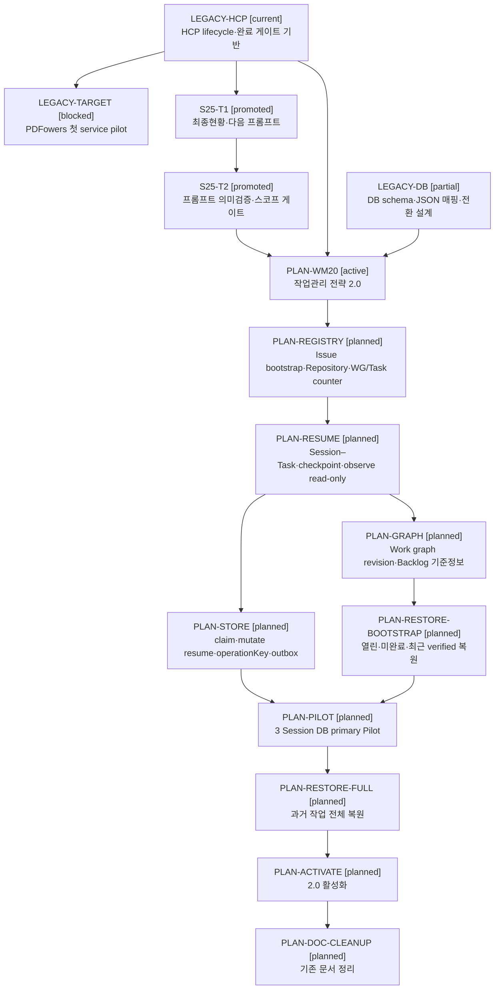

# RDM-005 프로젝트 작업그래프

| 항목 | 값 |
|---|---|
| 문서 ID | RDM-005 |
| 문서 유형 | 로드맵 |
| 상태 | Draft |
| 성숙도 | Candidate |
| 버전 | v0.1 |
| 소유자 | jk |
| 작성 에이전트 | Codex |
| 기준 브랜치 | main |
| 작업 브랜치 | task_codex/176-wg-task-work-item-loop-backlog-session-task-session-wg-issue-issue-task-issue-shared-umbrella-repository-registry-wg-counter-task-claim-json-db-dev-stg-prd-backlog |
| 최종 수정일 | 2026-07-31 |
| 관련 Issue | [#176](https://github.com/jkoogit/jkadh/issues/176) |
| 현황 기준 | origin dev/stg/main `b1f622ba8633c3d7fedc360c8131d55cc52dc3fe` |
| 그래프 적용 상태 | Bootstrap snapshot. 2.0 DB 작업그래프 구현 전까지 문서 현행화 |

## 목차

- [1. 목적과 운영 지위](#1-목적과-운영-지위)
- [2. 관리 원칙](#2-관리-원칙)
- [3. 상태와 관계 표기](#3-상태와-관계-표기)
- [4. 작업 현황 그래프](#4-작업-현황-그래프)
- [5. 작업항목 속성](#5-작업항목-속성)
- [6. 세션 025 작업현황](#6-세션-025-작업현황)
- [7. 미해결 Backlog](#7-미해결-backlog)
- [8. 우선작업 후보](#8-우선작업-후보)
- [9. 과거 작업 복원 현황](#9-과거-작업-복원-현황)
- [10. 세션정리 현행화 계약](#10-세션정리-현행화-계약)
- [11. 구현 이후 전환](#11-구현-이후-전환)
- [12. 관련 문서](#12-관련-문서)
- [작업 이력](#작업-이력)

## 1. 목적과 운영 지위

본 문서는 JKADH의 작업 방향이 Session 분기와 보완 작업 속에서 흐려지지 않도록 지속 목표, 실행 Task, 미해결 Backlog와 다음 우선 후보를 하나의 그래프로 관리한다.

이 문서는 DSN-013 작업관리 전략 2.0의 운영 projection이다. 2.0 DB 구현 전에는 세션정리에서 문서를 직접 현행화하고, 구현 후에는 DB snapshot을 검증 가능한 형식으로 렌더링한다.

현재 snapshot은 과거 전체 작업을 복원한 완성 그래프가 아니다. 공식 WG allocator가 없으므로 기존 Session·Issue·PR·문서에 임의 WG ID를 소급 부여하지 않고 `LEGACY-*`, `PLAN-*` 임시 node key를 사용한다. 영구 ID는 복원 ledger와 사용자 검토를 거쳐 발급한다.

## 2. 관리 원칙

1. 작업항목은 제목, 유형, 상태, 관계, 근거 링크와 다음 조건을 함께 기록한다.
2. 방향을 설명하는 지속 목표와 실제 변경 lifecycle인 Task를 구분한다.
3. 완료 항목을 삭제하지 않고 접어서 유지해 분기와 선후관계를 보존한다.
4. Session Backlog와 전역 Backlog를 분리해 같은 최종 리뷰에서 표시한다.
5. Deferred 전역 Backlog는 상태와 재개 조건을 유지하고 즉시 우선후보에서 제외한다.
6. 사용자가 선택하지 않은 후보를 Issue·WG로 자동 전환하지 않는다.
7. 세션정리 때 해당 Session의 Task·Issue·PR·branch·작업트리 결과와 그래프를 함께 현행화한다.
8. 원격 또는 필수 evidence가 unavailable이면 상태를 추정하지 않고 `UNKNOWN` 또는 `review_required`로 표시한다.
9. WG·Task ID는 DB에서 즉시 확정하고 Issue에는 최소 식별 표시를 즉시 시도하되, Issue 본문과 작업그래프의 종합 현행화는 checkpoint·세션정리에서 수행한다.
10. outbox는 일반 상태 변경 재처리용이며 counter·claim·외부 작업 확정을 대신하지 않는다.
11. 세션시작은 현재 후보와 관련된 pending 권한·외부 작업과 rollback fence를 신규 작업보다 먼저 복구한다.
12. Session–Task 관계·checkpoint·observe, claim 기반 mutate 재개, dual-write와 DB primary Pilot을 서로 다른 활성화 단계로 운영한다.

## 3. 상태와 관계 표기

### 3.1 상위 작업 상태

| 상태 | 의미 |
|---|---|
| `current` | 현재 운영 원본 또는 회귀 기준으로 사용 중 |
| `partial` | 일부 설계·구현 evidence는 있으나 목표 범위가 완성되지 않음 |
| `candidate` | 실행 전 검토 후보 |
| `planned` | 범위와 선행조건을 합의했지만 시작하지 않음 |
| `active` | 현재 Session 또는 Task에서 작업 중 |
| `blocked` | 명시된 외부 조건이나 오류 때문에 진행 불가 |
| `deferred` | 재개 조건 전까지 의도적으로 제외 |
| `completed` | 목표 완료·검증됨 |
| `superseded` | 새 작업 경계로 대체되고 이력만 유지 |
| `review_required` | 근거 충돌 또는 과거 복원 검토 필요 |

Task의 실제 HCP 상태 `active`, `closed`, `promoted`, `blocked`, `failed`는 그대로 병기한다.

### 3.2 관계

| 관계 | 의미 |
|---|---|
| `contains` | 상위 목표가 Task 또는 Work Item을 포함 |
| `depends_on` | 선행 완료 필요 |
| `derived_from` | 작업 중 발견되어 파생 |
| `blocks` | 대상 진행을 현재 차단 |
| `implements` | 설계 또는 계획을 구현 |
| `validates` | 구현 결과를 Pilot·검증 |
| `supersedes` | 기존 경계를 명시적으로 대체 |
| `relates` | 참고 관계이며 선행조건은 아님 |

## 4. 작업 현황 그래프

기준 시각은 2026-07-31이며 Issue #176은 OPEN, 열린 PR은 없고 원격 `dev/stg/main`은 `b1f622ba8633c3d7fedc360c8131d55cc52dc3fe`로 정렬돼 있다.



그래프의 `partial`은 DB 기반 schema와 설계가 존재하지만 HCP write-store가 운영 원본이 아니라는 뜻이다. `blocked`인 타겟서비스 작업은 전략 2.0 때문에 차단된 것이 아니라 기존 PDFowers 이메일 인증 작업의 소유권과 clean 작업환경 확인이 필요하기 때문이다.

## 5. 작업항목 속성

| Node | 제목 | 유형 | 상태 | 관계 | 근거 | 다음 조건 |
|---|---|---|---|---|---|---|
| `LEGACY-HCP` | HCP lifecycle·완료 게이트 기반 | platform baseline | current | `contains S25-T1`, `contains S25-T2` | [REF-003](../16.참고/REF-003_Harness_태그기반_프로세스_자동화_검토.md), [RET-023](../12.회고/RET-023_2026-07-29_024_HCP_세션작업_운영검증과_세션정리_Issue결산게이트_보완_회고.md) | 2.0 구현의 회귀 기준으로 유지 |
| `LEGACY-DB` | HCP DB schema·JSON 매핑·write-store 전환 설계 | data foundation | partial | `depends_on LEGACY-HCP`, `supports PLAN-WM20` | [DSN-004](../05.설계/DSN-004_Harness_DB_운영데이터_설계.md), [DSN-008](../05.설계/DSN-008_DB_테이블_설계서.md), [DSN-009](../05.설계/DSN-009_HCP_JSON_DB_매핑_설계.md), [DSN-010](../05.설계/DSN-010_HCP_DB_write-store_전환_설계.md) | 2.0 논리 모델을 단계별 DDL·writer로 구현 |
| `LEGACY-TARGET` | PDFowers 첫 service pilot | service | blocked | `relates LEGACY-HCP` | [DSN-012](../05.설계/DSN-012_타겟서비스_개발운영구조와_배포판단.md), [RET-021](../12.회고/RET-021_2026-07-27_022_PDFowers_이메일인증_작업상태와_첫서비스pilot_착수조건_점검_회고.md) | 기존 이메일 인증 소유권과 clean 작업환경 확인 후 재판정 |
| `S25-T1` | 최종현황 리뷰·전역 Backlog 분리·다음 프롬프트 | Task | promoted | `derived_from LEGACY-HCP`, `precedes S25-T2` | [Issue #172](https://github.com/jkoogit/jkadh/issues/172), [PR #173](https://github.com/jkoogit/jkadh/pull/173) | 완료 이력 유지 |
| `S25-T2` | 실행 프롬프트 의미검증·Issue 왕복·스코프 게이트 | Task | promoted | `derived_from S25-T1`, `precedes PLAN-WM20` | [Issue #174](https://github.com/jkoogit/jkadh/issues/174), [PR #175](https://github.com/jkoogit/jkadh/pull/175) | 완료 이력 유지 |
| `PLAN-WM20` | HCP 작업관리 전략 2.0 | design Task | active | `depends_on LEGACY-HCP`, `depends_on LEGACY-DB` | [DSN-013](../05.설계/DSN-013_HCP_작업관리_전략_2.0_설계.md), [Issue #176](https://github.com/jkoogit/jkadh/issues/176) | 문서 검증·태스크정리·승급 |
| `PLAN-REGISTRY` | Issue bootstrap·Coordination/Execution Repository·WG/Task counter | platform | planned | `implements PLAN-WM20` | DSN-013 6~8장·19장 | 등록 Issue 선행생성·2단계 ID 확정, `shared_registration`, 복합 key와 fail-closed counter 구현 |
| `PLAN-RESUME` | SessionInfo·Task 관계·checkpoint·observe read-only | platform | planned | `depends_on PLAN-REGISTRY` | DSN-013 9장·11장 | 관계·same-workspace checkpoint·observe 구현, claim 전 mutate 재개 차단 |
| `PLAN-GRAPH` | 작업그래프 revision·Backlog 기준정보 | platform | planned | `depends_on PLAN-RESUME` | DSN-013 16장·18장 | graph revision·snapshot과 migration dry-run 구현 |
| `PLAN-STORE` | claim·mutate 재개·DB write-store·외부 작업 복구 | data/platform | planned | `depends_on PLAN-RESUME`, `extends LEGACY-DB` | DSN-013 12~15장 | DB-first operationKey, 일반 mutation outbox, capability·JSON mirror·rollback fence 검증 |
| `PLAN-RESTORE-BOOTSTRAP` | 열린·미완료·최근 verified 자료 복원 | migration | planned | `depends_on PLAN-GRAPH` | DSN-013 17장 | Pilot 충돌·selected-next 누락이 없는 최소 manifest |
| `PLAN-PILOT` | DB primary 세 Session Pilot | validation | planned | `depends_on PLAN-STORE`, `depends_on PLAN-RESTORE-BOOTSTRAP` | DSN-013 13장·21장 | required scenario와 장애훈련 통과 |
| `PLAN-RESTORE-FULL` | 과거 작업 전체 복원 | migration | planned | `depends_on PLAN-PILOT` | DSN-013 17장 | Issue 없는 자료의 legacy `unresolved` 유지, 승인형 복원 Issue와 전체 coverage audit |
| `PLAN-ACTIVATE` | 작업관리 전략 2.0 활성화 | operation | planned | `depends_on PLAN-RESTORE-FULL` | DSN-013 19장·21장 | 사용자 승인, 운영 원본 전환 기록 |
| `PLAN-DOC-CLEANUP` | 기존 문서 유지·통합·보관 정리 | documentation | planned | `depends_on PLAN-ACTIVATE` | DSN-013 22장 | 별도 Task에서 색인·기존 본문 정리 |

## 6. 세션 025 작업현황

### 6.1 Session Task와 원격 결과

| Task | 상태 | Issue | Task PR | 승급 commit | 결과 |
|---|---|---|---|---|---|
| `codex_task_025_001` | promoted | [#172](https://github.com/jkoogit/jkadh/issues/172) | [#173](https://github.com/jkoogit/jkadh/pull/173) | `ab543127b6e16e8c6437c6060d2f62a55dcd7d3c` | 최종 리뷰·Backlog 분리·동적 프롬프트와 공통 종료 프로토콜 |
| `codex_task_025_002` | promoted | [#174](https://github.com/jkoogit/jkadh/issues/174) | [#175](https://github.com/jkoogit/jkadh/pull/175) | `b1f622ba8633c3d7fedc360c8131d55cc52dc3fe` | 프롬프트 의미검증·Issue 왕복·task_process·review·scope graph 안정화 |
| `codex_task_025_003` | active | [#176](https://github.com/jkoogit/jkadh/issues/176) | 없음 | 없음 | DSN-013·RDM-005 dual-write·세션시작 복구·단계별 활성화 최종 보완·재검증 완료, 태스크정리 대기 |

### 6.2 현재 Work Item

| 표시 ID | 상태 | 제목 | 부모 |
|---|---|---|---|
| `T3.1` | done | SESSION-025-TASK-003 HCP 작업관리 전략 2.0 용어·엔터티·생명주기·DB 전환정책 확정 | `codex_task_025_003` |

Task 1·2의 Work Item은 모두 `done`이며 Task는 `promoted`다. Task 3의 Work Item은 dual-write·세션시작 복구·단계별 활성화의 최종 정합성 보완과 재검증을 마쳐 `done`이며 Task는 태스크정리 전이므로 `active`다. Task 3에는 필수 Loop가 없다.

Task 3이 같은 Session에서 장기 전략 논의로 분기된 것은 현행 HCP로 수행한 기존 사실이며 2.0 단일 목표 정책을 소급 적용하지 않는다. 2.0 활성화 후 같은 상황이 발생하면 기존 primary WG와의 목적 일치를 검증하고, 목표가 달라졌다면 현재 Session을 인계·종료한 뒤 새 Session에서 신규 또는 재개 Task를 시작한다.

### 6.3 현재 원격·작업트리 snapshot

| 항목 | 상태 |
|---|---|
| Issue #176 | OPEN |
| 열린 PR | 없음 |
| origin/dev | `b1f622ba8633c3d7fedc360c8131d55cc52dc3fe` |
| origin/stg | `b1f622ba8633c3d7fedc360c8131d55cc52dc3fe` |
| origin/main | `b1f622ba8633c3d7fedc360c8131d55cc52dc3fe` |
| branch 정렬 | 정렬됨 |
| 현재 branch | Task 3 등록 branch |
| 작업트리 기준 | 태스크처리 시작 전 `.hcp/` runtime만 untracked; 신규 문서 변경은 Task 3 범위 |

## 7. 미해결 Backlog

### 7.1 Session Backlog

2026-07-31 Task 3 처리 시작 snapshot 기준 열린 Session Backlog는 없다. 현재 Task에서 새 후속 항목이 발견되면 `current_task`, `next_task`, `backlog`, `cancelled` 중 하나로 분류한 뒤 이 절을 갱신한다.

### 7.2 전역 문서 Backlog

아래 목록은 전역 Backlog 문서와 의도적으로 중복 관리한다. 상태와 재개 조건의 운영 원본은 활성화 전까지 각 Backlog 문서다.

| Backlog | 제목 | 상태 | 우선순위 | 재개 조건 요약 | 관계 |
|---|---|---|---|---|---|
| [BLG-022](../15.로그/backlog/2026/07/07/BLG-022_Backlog_문서_템플릿_분리_검토.md) | Backlog 문서 템플릿 분리 검토 | Deferred | Low | 공식 문서 Header 적용 결과를 확인하는 정기 점검 또는 사용자 명시 선택 | `relates PLAN-DOC-CLEANUP` |
| [BLG-031](../15.로그/backlog/2026/07/25/BLG-031_GitHub_외부_payload_승인과_HCP_실행권한_분리.md) | GitHub 외부 payload 승인과 HCP 실행권한 분리 | Deferred | Medium | 승인 거절·부분 완료·재승인 불명확·감사 요구가 실제 재현 | `relates PLAN-STORE` |
| [BLG-032](../15.로그/backlog/2026/07/25/BLG-032_세션종료후_태스크브랜치_lifecycle_후처리_보강.md) | 세션 종료 후 태스크 브랜치 lifecycle 후처리 보강 | Deferred | Medium | 후처리 누락이 잘못된 시작 commit·태스크 차단·PR 충돌로 재현 | `relates LEGACY-HCP` |
| [BLG-134-001](../15.로그/backlog/2026/07/25/BLG-134-001_Loop_criteria_자동평가_동시revision_budget_재평가.md) | Loop criteria 자동평가·동시 revision·budget 재평가 | Deferred | Low | 거짓 완료·다중 agent revision 충돌·통제되지 않는 장기 Loop와 측정 source가 재현 | `relates PLAN-RESUME` |

네 항목 모두 즉시 우선작업 후보에서 제외한다. DSN-013과의 관계가 생겼다는 이유만으로 재개 조건이 충족된 것으로 보지 않는다.

## 8. 우선작업 후보

### 8.1 현재 우선순위

| 순위 | 후보 | category | 상태 | 선정 근거 | 시작 조건 |
|---:|---|---|---|---|---|
| 1 | `PLAN-WM20` Task 3 완료 | `user_proposed` | active | 현재 claim과 Issue #176이 있는 미완료 Task | 문서 검증 후 태스크정리·승급 |
| 2 | `PLAN-REGISTRY` | `platform_feature` | planned | 나머지 2.0 기능의 ID·Repository 기반 선행조건 | Task 3 promoted, 독립 Issue·범위 확정 |
| 3 | `PLAN-RESUME` | `platform_feature` | planned | Session–Task 관계·checkpoint·observe로 재개 기반을 먼저 마련 | Registry·WG 최소 기반 완료 |
| 4 | `PLAN-STORE` | `platform_feature` | planned | claim 기반 mutate 재개와 DB 동시성·부분 실패 복구의 필수 기반 | Session–Task 관계·checkpoint read-only 검증 완료 |
| 5 | `LEGACY-TARGET` 재판정 | `service` | blocked | 실제 서비스 가치 작업 | PDFowers 기존 이메일 인증 소유권·clean 환경 확인 |

`PLAN-GRAPH`, `PLAN-RESTORE-BOOTSTRAP`, `PLAN-PILOT`, `PLAN-RESTORE-FULL`은 위 선행조건을 충족한 뒤 순서가 올라간다. 쉬운 문서 보완은 critical path를 막지 않는 한 서비스·핵심 구현보다 자동으로 우선하지 않는다.

### 8.2 세션정리 선택 규칙

- 현재 active/blocked Task의 복구·완료를 신규 후보보다 먼저 검토한다.
- 사용자가 제안한 후보를 우선 표시하되 안전·의존성 위반이면 차단 근거를 함께 표시한다.
- 오류·데이터 손실·거짓 완료는 유형과 무관하게 상향한다.
- 긴급성, critical path, 사용자 가치, 확정도, 비용과 누락 복구를 함께 평가한다.
- Deferred는 재개 조건 충족 여부를 별도 보고하되 기본 후보에서 제외한다.
- 최종 선택은 사용자 승인 후 `selected_next`로 기록하고 실제 값이 채워진 다음 Session 프롬프트를 생성한다.

## 9. 과거 작업 복원 현황

| 범위 | 현재 coverage | 신뢰도 | 남은 작업 |
|---|---|---|---|
| Session 024 | RET-023 closing snapshot과 complete 결과 확인 | verified | DB restore ledger 적재는 미실행 |
| Session 025 Task 1~3 | HCP runtime, Issue·PR·commit으로 확인 | verified | Task 3 완료 후 최종 현행화 |
| DB foundation | 설계·migration·baseline 존재 확인 | verified | 실제 운영 row와 write-store 상태 복원 필요 |
| HCP 이전 Session 전체 | 회고와 Git 이력 존재 | documented/partial | Session·Task·Issue·PR 전수 manifest 생성 |
| 과거 Work Item·Loop | 일부 HCP runtime·회고에 존재 | partial | 근거가 있는 상세항목만 복원 |
| 영구 WG | allocator 미구현 | unresolved | 기존 Issue가 검증된 경우만 사용자 검토 뒤 발급. Issue가 없으면 legacy 유지 또는 승인형 복원 Issue 생성 |

과거 전체 복원은 아직 실행하지 않았다. 이 문서의 legacy node는 탐색 진입점이며 복원 완료 선언이 아니다.

## 10. 세션정리 현행화 계약

각 `#세션정리`는 RDM-005에 다음 변경을 반영해야 한다.

1. 해당 Session의 모든 Task와 Work Item·Loop 최종 상태
2. 관련 Issue의 OPEN/CLOSED와 `close`, `keep`, `handoff` 결과
3. Task PR·세션정리 PR·승급 commit
4. `dev/stg/main` 정렬과 작업트리 snapshot
5. Session Backlog와 전역 Backlog를 분리한 현황
6. 새 작업 node·관계·상태·근거 링크
7. 누락 항목의 Task·Backlog·취소·인계 결정
8. 우선후보 재평가와 사용자가 선택한 `selected_next`
9. 실행 가능한 다음 `#세션시작`·`#태스크시작` 프롬프트 입력값
10. 신규 WG·Task의 즉시 ID 확정과 Issue 최소 표시 `pending_sync`가 남지 않았는지 확인
11. 미완료 Task `continued`의 checkpoint·claim 해제·Issue keep/handoff·재개 프롬프트 gate
12. 현재 후보와 관련된 pending outbox·권한 operation·external operation·reconciliation conflict·rollback fence의 복구 결과

문서 갱신과 실제 원격 결과 사이에 차이가 있으면 세션정리를 성공 처리하지 않는다. 단, 2.0 활성화 전 RDM-005가 아직 현행 lifecycle의 필수 gate로 구현되지 않았으므로 Task 3 이후 별도 구현에서 fail-closed 여부를 도입한다.

### 10.1 병렬 Session 갱신 경계

현재처럼 한 작업자만 운영하는 동안에는 세션정리 Task가 RDM-005를 직접 갱신한다. 여러 Session·agent가 병렬 운영되기 전에는 다음 단계로 전환한다.

1. 각 Session은 공용 RDM-005를 직접 덮어쓰지 않고 append-only graph snapshot을 생성한다.
2. snapshot은 Session ID, base commit, `graphRevision`, `asOfEventId`와 content hash를 가진다.
3. 하나의 통합 Task 또는 generator만 최신 snapshot들을 병합해 RDM-005를 갱신한다.
4. 읽은 revision과 쓰기 직전 revision이 다르면 갱신을 중단하고 다시 렌더링한다.
5. DB graph 활성화 뒤에는 DB event가 원본이고 RDM-005는 deterministic projection이 된다.

이 전환 전에는 같은 RDM-005를 수정하는 병렬 세션정리를 허용하지 않는다. 다른 Session의 node·edge·우선순위를 마지막 writer가 덮어쓰는 방식은 금지한다.

## 11. 구현 이후 전환

2.0 작업그래프 DB 구현 뒤 RDM-005는 수동 중복 원장이 아니라 검증 가능한 projection으로 전환한다.

```text
DB work graph snapshot
→ graphRevision·asOfEventId compare-and-set
→ deterministic Markdown/Mermaid render
→ 기존 RDM-005와 diff
→ Session close review
→ 승인된 snapshot commit
```

전환 시에도 제목·설명·전략 판단은 문서에 남긴다. DB는 node·edge·상태·우선순위·문서 참조를 제공하고, 문서 생성기는 원본에 없는 WG나 완료 상태를 추정하지 않는다.

구현·Pilot이 끝나기 전에는 기존 로드맵·설계·참고 문서와 색인을 수정하지 않는다. 활성화 뒤 별도 문서정리 Task에서 중복과 읽기 순서를 정비한다.

## 12. 관련 문서

- [DSN-013 HCP 작업관리 전략 2.0 설계](../05.설계/DSN-013_HCP_작업관리_전략_2.0_설계.md)
- [RDM-001 단계적 추진방향](./RDM-001_단계적_추진방향.md)
- [DSN-010 HCP DB write-store 전환 설계](../05.설계/DSN-010_HCP_DB_write-store_전환_설계.md)
- [DSN-011 Harness 완료조건 탐구와 루프 개선관리 설계](../05.설계/DSN-011_Harness_완료조건_탐구와_루프_개선관리_설계.md)
- [DSN-012 타겟서비스 개발운영구조와 배포판단](../05.설계/DSN-012_타겟서비스_개발운영구조와_배포판단.md)
- [REF-012 HCP 세션 작업 Work Item 관리 사용방법](../16.참고/REF-012_HCP_세션작업_Work_Item_관리_사용방법.md)
- [Backlog 미해결 인덱스](../15.로그/backlog/README.md)
- [RET-023 세션 024 회고](../12.회고/RET-023_2026-07-29_024_HCP_세션작업_운영검증과_세션정리_Issue결산게이트_보완_회고.md)
- [Issue #176](https://github.com/jkoogit/jkadh/issues/176)

[목차로 이동](#목차)

---

## 작업 이력

| 작업일시 | 관련 Issue | 작업 도구 | AI 모델 | 에이전트 역할 | 작성자 | 변경 유형 | 내용 |
|---|---|---|---|---|---|---|---|
| 2026-07-31 | [#176](https://github.com/jkoogit/jkadh/issues/176) | Codex | GPT-5 | CTO / Research | jk / Codex | Create | 작업관리 전략 2.0의 bootstrap 작업그래프, 작업 속성, Session·전역 Backlog 분리, 우선후보와 세션정리 현행화 계약 작성 |
| 2026-07-31 | [#176](https://github.com/jkoogit/jkadh/issues/176) | Codex | GPT-5 | CTO / Research | jk / Codex | Revise | checkpoint·멀티레포·outbox·rollback fence 구현단계와 bootstrap/Pilot/full restore 순서, 병렬 graph revision 갱신 경계 반영 |
| 2026-07-31 | [#176](https://github.com/jkoogit/jkadh/issues/176) | Codex | GPT-5 | CTO / Research | jk / Codex | Revise | Issue bootstrap·2단계 ID, 등록 Issue 공유 예외, 저장모드 capability·outbox 경계·JSON mirror gate, 무Issue 복원과 continued close 조건 반영 |
| 2026-07-31 | [#176](https://github.com/jkoogit/jkadh/issues/176) | Codex | GPT-5 | CTO / Research | jk / Codex | Revise | 일반·권한 mutation 순서와 operationKey, 세션시작 pending 복구 gate, read-only→claim→mutate 재개 활성화 단계를 작업그래프에 반영 |
