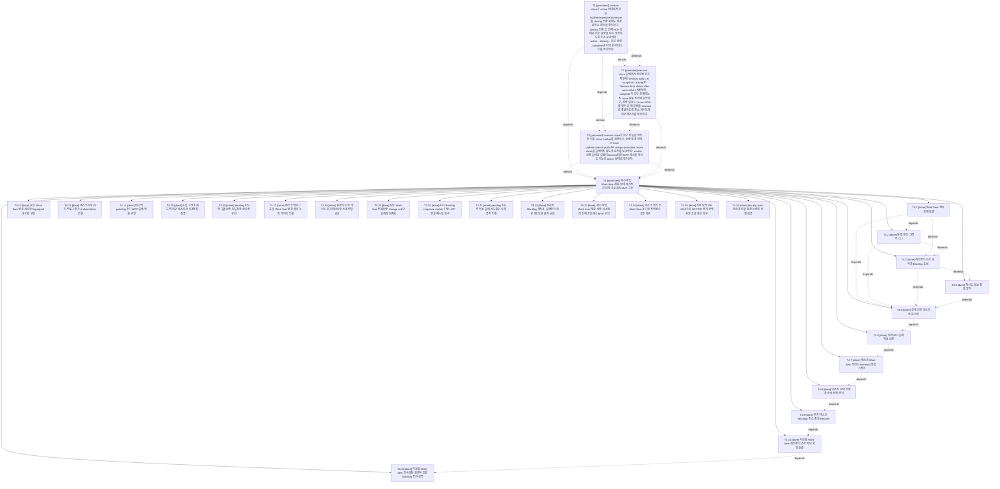

# RET-022 2026-07-28 023_HCP_세션정리_회고snapshot_상태전환_보완

| 항목 | 값 |
|---|---|
| 문서 ID | RET-022 |
| 문서 유형 | 회고 |
| 세션번호 | 023 |
| 세션명 | 023_HCP_세션정리_회고snapshot_상태전환_보완 |
| 상태 | Draft |
| 최종 수정일 | 2026-07-28 |

## 1. 완료 태스크

- codex_task_023_001 session close가 active 상태에서 만든 hcpRetrospectiveSummary를 closing 전환 뒤에도 재사용하는 원인을 확인하고, closing 전환 후 현재 HCP 상태로 회고 요약을 다시 생성하도록 최소 보완하며 active→closing→회고 생성→complete 순서의 회귀 테스트를 추가한다.
- codex_task_023_002 session close 실행에서 생성된 회고 파일에 'Session status at snapshot: closing'과 'Session final status after successful #세션정리: complete'가 모두 존재하는지 Issue 종료 직전에 검증하고, 검증 실패 시 Issue #154를 열어 둔 채 실행을 blocked로 종료하도록 최소 게이트와 회귀 테스트를 추가한다.
- codex_task_023_003 session close가 회고 파일을 생성한 직후 close marker를 검증하고, 검증 통과 전에는 Issue update·commit·push·PR·merge·promotion·Issue close를 실행하지 않도록 순서를 보완한다. marker 검증 실패로 실행이 blocked되면 HCP 세션을 재시도 가능한 active 상태로 복구한다.
- codex_task_023_004 세션 작업 Work Item 계층·상태·세션정리 인계 프로세스 MVP 구현

## 2. Issue 현행화

세션 023 실제 정리에서 closing snapshot과 successful complete marker를 검증하고 Issue #154 종료 조건을 충족했다.

## 3. 남은 작업

세션 023 범위의 미완료 태스크와 Work Item 없음

## 4. 회고

세션정리 상태 전환·회고 marker·재시도 복구와 세션 Work Item 계층·상태·응답 자동등록·피드백·Backlog 복구 프로세스를 구현하고 실제 세션 023에 적용했다.

## 5. 미정리 문서

- 없음

## 6. 다음 세션 인계

다음 세션 024에서는 세션 Work Item 프로세스의 실제 운영 결과를 점검하고 열린 Backlog와 Issue 중 다음 우선 작업을 선정한다.

## HCP Session State

- Session ID: codex_ses_023_20260727_001
- Agent ID: codex
- Session number: 023
- Session status at snapshot: closing
- Session final status after successful #세션정리: complete
- Linked issue: #154
- Tasks: 4
  - codex_task_023_001 [promoted] session close가 active 상태에서 만든 hcpRetrospectiveSummary를 closing 전환 뒤에도 재사용하는 원인을 확인하고, closing 전환 후 현재 HCP 상태로 회고 요약을 다시 생성하도록 최소 보완하며 active→closing→회고 생성→complete 순서의 회귀 테스트를 추가한다.
  - codex_task_023_002 [promoted] session close 실행에서 생성된 회고 파일에 'Session status at snapshot: closing'과 'Session final status after successful #세션정리: complete'가 모두 존재하는지 Issue 종료 직전에 검증하고, 검증 실패 시 Issue #154를 열어 둔 채 실행을 blocked로 종료하도록 최소 게이트와 회귀 테스트를 추가한다.
  - codex_task_023_003 [promoted] session close가 회고 파일을 생성한 직후 close marker를 검증하고, 검증 통과 전에는 Issue update·commit·push·PR·merge·promotion·Issue close를 실행하지 않도록 순서를 보완한다. marker 검증 실패로 실행이 blocked되면 HCP 세션을 재시도 가능한 active 상태로 복구한다.
  - codex_task_023_004 [promoted] 세션 작업 Work Item 계층·상태·세션정리 인계 프로세스 MVP 구현
- Backlog items: 0

## Session Task and Work Item Graph

- T1 [promoted] session close가 active 상태에서 만든 hcpRetrospectiveSummary를 closing 전환 뒤에도 재사용하는 원인을 확인하고, closing 전환 후 현재 HCP 상태로 회고 요약을 다시 생성하도록 최소 보완하며 active→closing→회고 생성→complete 순서의 회귀 테스트를 추가한다.
- T2 [promoted] session close 실행에서 생성된 회고 파일에 'Session status at snapshot: closing'과 'Session final status after successful #세션정리: complete'가 모두 존재하는지 Issue 종료 직전에 검증하고, 검증 실패 시 Issue #154를 열어 둔 채 실행을 blocked로 종료하도록 최소 게이트와 회귀 테스트를 추가한다. (depends: codex_task_023_001; derived: codex_task_023_001)
- T3 [promoted] session close가 회고 파일을 생성한 직후 close marker를 검증하고, 검증 통과 전에는 Issue update·commit·push·PR·merge·promotion·Issue close를 실행하지 않도록 순서를 보완한다. marker 검증 실패로 실행이 blocked되면 HCP 세션을 재시도 가능한 active 상태로 복구한다. (depends: codex_task_023_001, codex_task_023_002; derived: codex_task_023_002)
- T4 [promoted] 세션 작업 Work Item 계층·상태·세션정리 인계 프로세스 MVP 구현 (depends: codex_task_023_001, codex_task_023_002, codex_task_023_003; derived: codex_task_023_003)
  - T4.1 [done] Work Item 상태·관계 모델
  - T4.2 [done] 등록·갱신·그래프 CLI (depends: codex_work_023_001)
  - T4.3 [done] 세션정리 회고 요약과 Backlog 후보 (depends: codex_work_023_001, codex_work_023_002)
  - T4.4 [done] 재시도 후보 중복 방지 (depends: codex_work_023_003)
  - T4.5 [done] 전체 회귀 테스트와 문서화 (depends: codex_work_023_001, codex_work_023_002, codex_work_023_003, codex_work_023_004)
  - T4.6 [done] 세션 023 실제 적용 검증 (depends: codex_work_023_005)
  - T4.7 [done] 태스크·Work Item 텍스트·Mermaid 통합 그래프 (depends: codex_work_023_006)
  - T4.8 [done] 의존성 상태 전환과 상세 변경 증거 (depends: codex_work_023_007)
  - T4.9 [done] 추가 태스크·Backlog·취소 종결 lifecycle (depends: codex_work_023_008)
  - T4.10 [done] 미완료 Work Item 세션정리 조기 차단 회귀 검증 (depends: codex_work_023_009)
  - T4.11 [done] 미완료 Work Item 의사결정·원자적 연결·Backlog 증거 검증 (depends: codex_work_023_010)
  - T4.12 [done] 응답 Work Item 변경 세트와 fingerprint 동기화 구현
  - T4.13 [done] 태스크시작·처리·백로그추가 orchestration 연결
  - T4.14 [done] 피드백 pending·차기 HCP 실행 적용 구현
  - T4.15 [done] 응답 그래프·피드백 회귀 테스트와 사용방법 검증
  - T4.16 [done] pending 피드백 일괄검증·단일저장 원자성 구현
  - T4.17 [done] 태스크·백로그 응답 Work Item 변경 세트 누락 게이트 연결
  - T4.18 [done] 원자성·누락 게이트 회귀 테스트와 사용방법 보완
  - T4.19 [done] 응답 Work Item 전체검증·change set 단일저장 원자화
  - T4.20 [done] 문서 Backlog response marker 기반 HCP 연결 재시도 복구
  - T4.21 [done] pending 피드백 적용 실패 시도횟수·오류 증거 기록
  - T4.22 [done] 원자성·Backlog 재사용·실패증거 회귀 테스트와 문서 보완
  - T4.23 [done] 세션 작업 Work Item 계층·상태·세션정리 인계 프로세스 MVP 구현
  - T4.24 [done] 태스크 정리 후 Work Item 동기화 지역변수 오류 복구
  - T4.25 [done] 최종 보정 PR #163으로 HCP PR 증거 현행화와 승급 차단 복구
  - T4.26 [done] dev·stg·main 승급과 로컬 환경 브랜치 정렬 검증

- Backlog conversion candidates: 0

