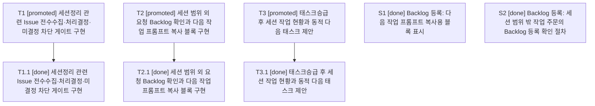

# RET-023 2026-07-29 024_HCP_세션작업_운영검증과_세션정리_Issue결산게이트_보완

| 항목 | 값 |
|---|---|
| 문서 ID | RET-023 |
| 문서 유형 | 회고 |
| 세션번호 | 024 |
| 세션명 | 024_HCP_세션작업_운영검증과_세션정리_Issue결산게이트_보완 |
| 상태 | Draft |
| 최종 수정일 | 2026-07-29 |

## 1. 완료 태스크

- codex_task_024_001 세션정리 관련 Issue 전수수집·처리결정·미결정 차단 게이트 구현
- codex_task_024_002 세션 범위 외 요청 Backlog 확인과 다음 작업 프롬프트 복사 블록 구현
- codex_task_024_003 태스크승급 후 세션 작업 현황과 동적 다음 태스크 제안

## 2. Issue 현행화

세션 024에서 Issue 결산 게이트, 범위 외 요청 Backlog 확인, 태스크승급 후 세션 현황과 동적 다음 작업 제안을 구현하고 전체 검증을 완료했다.

### 관련 Issue 결산

- #165: OPEN / close; 사유=-; 후속=-
- #167: OPEN / close; 사유=-; 후속=-
- #169: OPEN / close; 사유=-; 후속=-

## 3. 남은 작업

미완료 태스크 없음; 미완료 Work Item 없음; 열린 세션 Backlog 없음; 열린 PR 없음; 관련 Issue #165, #167, #169는 완료 범위로 종료한다.

## 4. 회고

세션 024에서 Work Item 자동등록과 변경 세트 절차를 실제 태스크에 적용했고, 세션정리 관련 Issue 전수 결산 게이트와 재시작 복구를 구현했다. 범위 외 자연어 요청의 Backlog 확인과 복사용 프롬프트를 구현했으며, 태스크승급 후 실제 세션 상태와 동적 다음 작업을 출력하고 원격 조회 실패를 비치명적으로 처리하도록 보완했다. 전체 240개 테스트와 실제 CLI 운영 경로를 검증했다.

## 5. 미정리 문서

- 없음

## 6. 다음 세션 인계

Session HCP_세션작업_운영검증과_세션정리_Issue결산게이트_보완 is closing. Completed tasks: codex_task_024_001 세션정리 관련 Issue 전수수집·처리결정·미결정 차단 게이트 구현; codex_task_024_002 세션 범위 외 요청 Backlog 확인과 다음 작업 프롬프트 복사 블록 구현; codex_task_024_003 태스크승급 후 세션 작업 현황과 동적 다음 태스크 제안. Unfinished tasks: none. Linked issue: #165. Session work items: 5 done; 0 unfinished. Backlog conversion candidates: none. Next backlog: none recorded in HCP state

```text
Session HCP_세션작업_운영검증과_세션정리_Issue결산게이트_보완 is closing. Completed tasks: codex_task_024_001 세션정리 관련 Issue 전수수집·처리결정·미결정 차단 게이트 구현; codex_task_024_002 세션 범위 외 요청 Backlog 확인과 다음 작업 프롬프트 복사 블록 구현; codex_task_024_003 태스크승급 후 세션 작업 현황과 동적 다음 태스크 제안. Unfinished tasks: none. Linked issue: #165. Session work items: 5 done; 0 unfinished. Backlog conversion candidates: none. Next backlog: none recorded in HCP state
```

## HCP Session State

- Session ID: codex_ses_024_20260728_001
- Agent ID: codex
- Session number: 024
- Session status at snapshot: closing
- Session final status after successful #세션정리: complete
- Linked issue: #165
- Tasks: 3
  - codex_task_024_001 [promoted] 세션정리 관련 Issue 전수수집·처리결정·미결정 차단 게이트 구현
  - codex_task_024_002 [promoted] 세션 범위 외 요청 Backlog 확인과 다음 작업 프롬프트 복사 블록 구현
  - codex_task_024_003 [promoted] 태스크승급 후 세션 작업 현황과 동적 다음 태스크 제안
- Backlog items: 2
  - codex_blg_024_001 [closed] 세션 범위 밖 작업 주문의 Backlog 등록 확인 절차
  - codex_blg_024_002 [closed] 다음 작업 프롬프트 복사용 블록 표시

## Session Task and Work Item Graph

- T1 [promoted] 세션정리 관련 Issue 전수수집·처리결정·미결정 차단 게이트 구현
  - T1.1 [done] 세션정리 관련 Issue 전수수집·처리결정·미결정 차단 게이트 구현
- T2 [promoted] 세션 범위 외 요청 Backlog 확인과 다음 작업 프롬프트 복사 블록 구현
  - T2.1 [done] 세션 범위 외 요청 Backlog 확인과 다음 작업 프롬프트 복사 블록 구현
- T3 [promoted] 태스크승급 후 세션 작업 현황과 동적 다음 태스크 제안
  - T3.1 [done] 태스크승급 후 세션 작업 현황과 동적 다음 태스크 제안
- S1 [done] Backlog 등록: 다음 작업 프롬프트 복사용 블록 표시
- S2 [done] Backlog 등록: 세션 범위 밖 작업 주문의 Backlog 등록 확인 절차



- Backlog conversion candidates: 0


