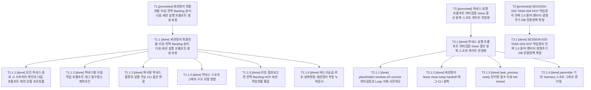

# RET-024 2026-07-31 025_HCP_세션정리_최종현황리뷰와_다음세션프롬프트_보완

| 항목 | 값 |
|---|---|
| 문서 ID | RET-024 |
| 문서 유형 | 회고 |
| 세션번호 | 025 |
| 세션명 | 025_HCP_세션정리_최종현황리뷰와_다음세션프롬프트_보완 |
| 상태 | Draft |
| 최종 수정일 | 2026-07-31 |

## 1. 완료 태스크

- codex_task_025_001 세션정리 최종현황 리뷰·전역 Backlog 분리·다음 세션 실행 프롬프트 생성 보완
- codex_task_025_002 하네스 실행 프롬프트 의미검증·Issue 결산 왕복·스코프 게이트 안정화
- codex_task_025_003 HCP 작업관리 전략 2.0 용어·엔터티·생명주기·DB 전환정책 확정

## 2. Issue 현행화

Issue #172·#174·#176의 promoted 결과와 close 결정을 반영하고 RDM-005 Session 025 closing snapshot을 현행화한다.

### 관련 Issue 결산

- #172: OPEN / close; 사유=-; 후속=-
- #174: OPEN / close; 사유=-; 후속=-
- #176: OPEN / close; 사유=-; 후속=-

## 3. 남은 작업

없음

## 4. 회고

Session 025에서 하네스 종료 리뷰·동적 다음 프롬프트·의미검증·Issue 결산·스코프 게이트를 구현하고 작업관리 전략 2.0 설계와 프로젝트 작업그래프를 확정했다. 세 Task와 전체 Work Item이 완료됐고 Session Backlog와 필수 Loop는 없으며 전역 Backlog 4건은 기존 Deferred 상태와 재개 조건을 유지한다.

## 5. 미정리 문서

- 없음

## 6. 다음 세션 인계

다음 우선 후보는 PLAN-REGISTRY다. 신규 독립 Issue에서 Repository registry, 등록 Issue 선행생성, WG·Task 2단계 ID 확정과 counter 기반을 구현 대상으로 검토한다. Deferred 전역 Backlog는 즉시 후보에서 제외한다.

```text
다음 우선 후보는 PLAN-REGISTRY다. 신규 독립 Issue에서 Repository registry, 등록 Issue 선행생성, WG·Task 2단계 ID 확정과 counter 기반을 구현 대상으로 검토한다. Deferred 전역 Backlog는 즉시 후보에서 제외한다.
```

## HCP Session State

- Session ID: codex_ses_025_20260729_001
- Agent ID: codex
- Session number: 025
- Session status at snapshot: closing
- Session final status after successful #세션정리: complete
- Linked issue: #172
- Tasks: 3
  - codex_task_025_001 [promoted] 세션정리 최종현황 리뷰·전역 Backlog 분리·다음 세션 실행 프롬프트 생성 보완
  - codex_task_025_002 [promoted] 하네스 실행 프롬프트 의미검증·Issue 결산 왕복·스코프 게이트 안정화
  - codex_task_025_003 [promoted] SESSION-025-TASK-003 HCP 작업관리 전략 2.0 용어·엔터티·생명주기·DB 전환정책 확정
- Backlog items: 0

## Session Task and Work Item Graph

- T1 [promoted] 세션정리 최종현황 리뷰·전역 Backlog 분리·다음 세션 실행 프롬프트 생성 보완
  - T1.1 [done] 세션정리 최종현황 리뷰·전역 Backlog 분리·다음 세션 실행 프롬프트 생성 보완
    - T1.1.1 [done] 모든 하네스 종료 시 누락처리 확인과 다음 프롬프트 제안 공통 프로토콜
    - T1.1.2 [done] 하네스별 다음 작업 프롬프트 태그·필수필드 제약조건
    - T1.1.3 [done] 복사용 하네스 블록의 실행 가능 CLI 옵션 변환
    - T1.1.4 [done] 하네스 스코프 그래프 구조 모델 정렬
    - T1.1.5 [done] 리뷰 결과보고의 전역 Backlog·HCP 세션 작업현황 통합
    - T1.1.6 [done] 태스크승급·루프 상태변경·세션정리 작업 누락검사
- T2 [promoted] 하네스 실행 프롬프트 의미검증·Issue 결산 왕복·스코프 게이트 안정화
  - T2.1 [done] 하네스 실행 프롬프트 의미검증·Issue 결산 왕복·스코프 게이트 안정화
    - T2.1.1 [done] placeholder·boolean·ID·commit 의미검증과 Loop 삭제 사전차단
    - T2.1.2 [done] 세션정리 Issue close·keep·handoff 태그-CLI 왕복
    - T2.1.3 [done] task_process ready 전이와 필수 리뷰 fail-closed
    - T2.1.4 [done] parentIds 기반 Harness 스코프 그래프 렌더링
- T3 [promoted] SESSION-025-TASK-003 HCP 작업관리 전략 2.0 용어·엔터티·생명주기·DB 전환정책 확정
  - T3.1 [done] SESSION-025-TASK-003 HCP 작업관리 전략 2.0 용어·엔터티·생명주기·DB 전환정책 확정



- Backlog conversion candidates: 0


