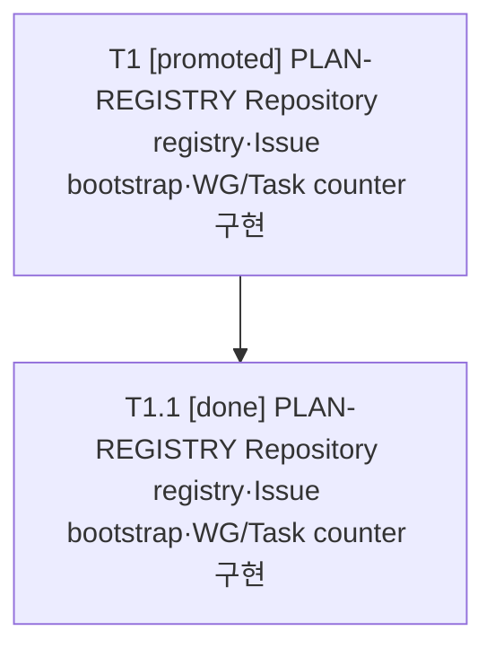

# RET-025 2026-08-11 026_HCP_PLAN_REGISTRY_구현범위확정과_착수

| 항목 | 값 |
|---|---|
| 문서 ID | RET-025 |
| 문서 유형 | 회고 |
| 세션번호 | 026 |
| 세션명 | 026_HCP_PLAN_REGISTRY_구현범위확정과_착수 |
| 상태 | Draft |
| 최종 수정일 | 2026-08-11 |

## 1. 완료 태스크

- codex_task_026_001 PLAN-REGISTRY Repository registry·Issue bootstrap·WG/Task counter 구현

## 2. Issue 현행화

PLAN-REGISTRY 구현과 검증을 완료했다. PR #182가 dev에 병합됐고 dev/stg/main은 dcd7d7fc824e91ba490ccf7ad884d44f7ba424c4로 정렬됐다. Repository registry, Issue bootstrap, WG/Task counter, 장애 fail-closed와 PostgreSQL 검증 경계를 자동 검증했으며 Issue #181 제목은 작업 의미를 보존한다.

### 관련 Issue 결산

- #181: OPEN / close; 사유=-; 후속=-

## 3. 남은 작업

이번 세션 미완료 작업 없음. BLG-022·031·032·134-001은 Deferred를 유지하고, 공통 리소스 실행 게이트와 #장애상태조회는 다음 신규 독립 Session·Issue 후보로 인계한다.

## 4. 회고

PLAN-REGISTRY의 저장 경계와 ID 비재사용·재실행 복구·Issue 검증·DB fail-closed 불변식을 구현했다. 외부 개발 DB 단절을 통해 장애 중 대체 DB로 작업을 계속하는 복잡성보다 작업 일시정지, operation_result_unknown 보존, 복구 후 전체 재검증이 현 단계에 적합함을 확인했다. 반복 보완 과정에서 운영 환경 오실행 차단, recovery-file run lock, migration 7 전후 불변성과 구조화 복구 결과까지 완료했다. 다음 단계에서는 DB·JKADH 원격·사용 에이전트 장애를 공통 실행 게이트로 단순 차단하고 #장애상태조회로 복구 여부를 read-only 확인하는 독립 기능을 다룬다.

## 5. 미정리 문서

- 없음

## 6. 다음 세션 인계

다음 세션은 DB·JKADH 원격·사용 에이전트 공통 실행 게이트와 #장애상태조회를 신규 독립 Issue로 시작한다. 장애 발생 시 현재 실행을 일시정지하고 상태·마지막 확정 경계·미확정 작업을 보존하며, read-only 복구 확인 후에만 재개한다. 서비스별 세밀한 degraded mode와 일반 offline queue·outbox는 제외한다.

```text
다음 세션은 DB·JKADH 원격·사용 에이전트 공통 실행 게이트와 #장애상태조회를 신규 독립 Issue로 시작한다. 장애 발생 시 현재 실행을 일시정지하고 상태·마지막 확정 경계·미확정 작업을 보존하며, read-only 복구 확인 후에만 재개한다. 서비스별 세밀한 degraded mode와 일반 offline queue·outbox는 제외한다.
```

## HCP Session State

- Session ID: codex_ses_026_20260731_001
- Agent ID: codex
- Session number: 026
- Session status at snapshot: closing
- Session final status after successful #세션정리: complete
- Linked issue: #181
- Tasks: 1
  - codex_task_026_001 [promoted] PLAN-REGISTRY Repository registry·Issue bootstrap·WG/Task counter 구현
- Backlog items: 0

## Session Task and Work Item Graph

- T1 [promoted] PLAN-REGISTRY Repository registry·Issue bootstrap·WG/Task counter 구현
  - T1.1 [done] PLAN-REGISTRY Repository registry·Issue bootstrap·WG/Task counter 구현



- Backlog conversion candidates: 0


